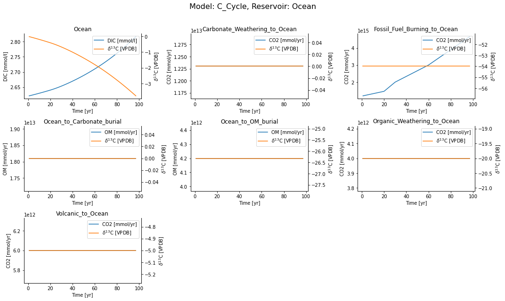

# Overview

ESBMTK provides a couple of classes which are use to define a
model. The classes are arranged in a hierarchical manner, starting
with the model class. The model class (or object), set's global
parameters like the model name, the time step etc. Next comes one or
more element objects which define basic element properties. Each
element can have one or more species. Note that these classes specify
units, however at present, these units are only used for display
purposes. It is therefore best, to use the same units throughout.

At present, these classes only specify the isotopic reference ratios,
and plot labels.

Next comes the source and sink class, which simply specify the name
and species, followed by reservoir object which specifies things like
reservoir name, reservoir size, reservoir species etc.

Sources, sinks, and reservoirs are connected through fluxes, and
fluxes are either forced by signals, or affected by processes. Most
processes can be derived implicitly from the way we connect reservoirs
(see below), however signal must be specified explicitly. It is thus
best to define these first (see the worked example below).

The connection between a source and a sink (or two reservoirs) is
handled by the connection class. This class will create the necessary
fluxes, and where possible add processes. Fluxes and processes are
also implemented as objects.

Each connector object can have more than one signal or process (or a
mixture of signals and processes). Each reservoir can have more than
one connector object.

## A worked example

In the following example we will set up a simple carbon cycle
model. The data forcing the anthropogenic carbon flux will be read
from a csv file. Interaction with external data is handled through the
external data object which allows to integrate external data into the
model framework. It can then be used to generate a signal, or it can
be associated with a reservoir so that the data is plotted with the
reservoir data.

## Setting up the model

We need to load all required libraries and all classes we want to
use. Interaction with the model classes is done through keyword/value
pairs. Use `help()` to inquire about the supported keyword value
pairs.

    from esbmtk import Model, Element, Species, Reservoir
    from esbmtk import Signal, Connect, Source, Sink, Flux
    from esbmtk import ExternalData
    import matplotlib.pyplot as plt
    
    # create model
    Model(
        name="C_Cycle",  # model name
        stop=100,         # end time of model
        time_unit="yr",  # time units 
        dt=1,            # time step
    )

## Declare elements and species

We register the elements(s) with the model by providing the model
name. Note that this is not a string, but the model handle which is
derived from the model name in the model definition above. We use the
element handle in a similar way to register the species with an
element.

    # Element properties
    Element(
        name="C",                  # Element Name
        model=C_Cycle,             # Model handle
        mass_unit="mmol",          # base mass unit
        li_label="C^{12$S",        # Name of light isotope
        hi_label="C^{13}$S",       # Name of heavy isotope
        d_label="$\delta^{13}$C",       # Name of isotope delta
        d_scale="VPDB",            # Isotope scale. End of plot labels
        r=0.0112372,  # VPDB C13/C12 ratio https://www-pub.iaea.org/MTCD/publications/PDF/te_825_prn.pdf
    )
    
    # add species
    Species(name="CO2", element=C)  # Name & element handle
    Species(name="DIC", element=C)
    Species(name="OM", element=C)

## Using external data and initializing a signal

We use the external data object to import CSV data into model. At
present, this must be a time vector in the first column and data in
the second column. The first row must contain a header. Next we feed
this object to the signal class to create a signal. Signals call also
by created by specifying a signal type. At present the class
understands, square, and pyramidal signal forms, as well as
repetition. Signal can be added to each other (i.e., you can specify a
signal which effects the flux, and then add another signal which
effects the isotope ratio). 

    ExternalData(name="mydata",
    	     filename="test-data.csv",
    	     legend="Test Data",
    	     model=C_Cycle,)
    
    Signal(name = "ACOR",
           species = CO2,
           delta = -27,           
           duration = 100, # must match what is in the file
           shape = "External Data",
           data = mydata   
    )

## Sources, Sinks and Reservoirs

    Source(name="Fossil_Fuel_Burning", species=CO2)
    Source(name="Carbonate_Weathering", species=CO2)
    Source(name="Organic_Weathering", species=CO2)
    Source(name="Volcanic", species=CO2)
    Sink(name="Carbonate_burial", species=OM)
    Sink(name="OM_burial", species=OM)
    
    Reservoir(
        name="Ocean",       # Name of reservoir
        species=DIC,        # Species handle
        delta=0,            # initial delta
        concentration=2.62, # mass in mol
        unit="mmol",        # mass unit
        volume=1.332E18,    # reservoir size (m^3)
    )

## Connecting sources, reservoirs and sinks

Now that all model elements are specified, we can connect
everything. Note how the previously specified `ACOR` signal is added
to the fossil fuel burning source. If the flux rate and delta are
provided, the flux is treated a static. If the delta is omitted, the
flux delta is driven by the upstream reservoir. If the flux is
omitted, the flux is set in such a way that it maintains the mass in
the reservoir. If the connection specifies a fractionation factor, the
flux delta is function of the upstream reservoir delta plus the
fractionation factor (`OM_burial`). Other processes like concentration
dependent fluxes will be available soon.

Fluxes can be circular, care must however be taken in which sequence
they are defined.

    # connect source to reservoir
    Connect(
        source=Fossil_Fuel_Burning,  # source of flux
        sink=Ocean,         # target of flux
        rate=0,              # weathering flux in 
        delta=0,            # set a default flux
        pl=[ACOR],
    )
    
    Connect(
        source=Carbonate_Weathering,  # source of flux
        sink=Ocean,         # target of flux
        rate=12.3E12,              # weathering flux in 
        delta=0,            # set a default flux
    )
    
    Connect(
        source=Organic_Weathering,  # source of flux
        sink=Ocean,         # target of flux
        rate=4.0E12,              # weathering flux in 
        delta=-20,            # set a default flux
    
    )
    
    Connect(
        source=Volcanic,  # source of flux
        sink=Ocean,         # target of flux
        rate=6.0E12,              # weathering flux in 
        delta=-5,            # set a default flux
    )
    
    Connect(
        source=Ocean,  # source of flux
        sink=OM_burial,         # target of flux
        rate=4.2E12,              # weathering flux in 
        delta=-26.32,            # set a default flux
    )
    
    Connect(
        source=Ocean,  # source of flux
        sink=Carbonate_burial,         # target of flux
        rate=18.1E12,              # weathering flux in 
        delta=0, # set a default flux
    )

## Running the model

The model is executed via the `run()` method. The results can be displayed withe the `plot_data()` method which will generate an overview graph for each reservoir. Export of the results to a csv file is done via the `save_data()` method which will create csv file for each reservoir.

    # Run the model
    C_Cycle.run()
    
    # plot the results
    C_Cycle.plot_data()
    C_Cycle.save_data()

Execution took 0.0055241230000002695 seconds

    <Figure size 1080x648 with 14 Axes>

