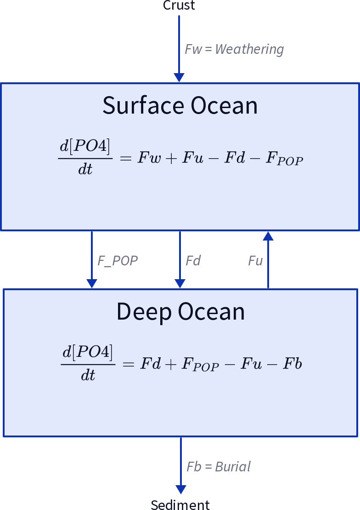
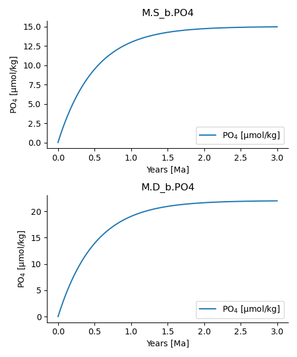

#+options: toc:nil author:nil num:nil

* Introduction

** Installation
*Note that ESBMTK 0.14.2.x requires python 3.12 or higher.*
*** Conda
ESBMTK is available via the conda-forge channel. To install ESBMTK into a new virtual environment:
#+BEGIN_SRC sh
conda create --name foo python=3.12
conda activate foo
conda config --add channels conda-forge
conda config --set channel_priority strict
conda install esbmtk
#+END_SRC

*** pip 

To install the latest released version from PyPI:
#+BEGIN_SRC sh
 python -m pip install esbmtk
#+END_SRC

*** GitHub

The package is also available through the ESBMTK GitHub repository:

https://github.com/uliw/esbmtk.

** A simple example:

Consider a simple model of the marine phosphorus cycle consisting of two ocean reservoirs:
- Surface reservoir
- Deep reservoir
In this model, phosphate enters the system through weathering, is transported via the thermohaline transport of dissolved PO_4 as well as the export of P in the form of sinking particulate organic matter, and is buried in the sediments. The concentration in the respective surface and deep water boxes is then the sum of the respective fluxes. The model is illustrated below in Figure 1, with parameters taken from Glover (2011), Modeling Methods for Marine Science.

#+attr_org: :width 300
#+attr_rst: :width 400
#+attr_latex: :width 0.5\textwidth
#+name: pcycle
#+caption: A two-box model of the marine P-cycle. F_w = weathering
#+caption: F_u = upwelling, F_d = downwelling, F_{POP} = particulate 
#+caption: organic phosphor, F_b = burial.

If we define equations that control the export of particulate P (F_{POP}) as a fraction of the upwelling P (F_u), and the burial of P (F_b) as a fraction of (F_{POP}), we can express this model as a system of coupled ordinary differential equations (ODEs):

\[
\frac{d[PO_{4}]_{S}}{dt} = \frac{F_w + F_u - F_d - F_{POP}}{V_S}
\]

for the surface ocean, 

\[
\frac{d[PO_{4}]_{D}}{dt}= \frac{F_{POP} + F_d - F_u - F_b}{V_D}
\]

for the deep ocean. 

The above can easily be implemented in Python as:

#+BEGIN_SRC ipython
def dCdt(t, C_0, V, F_w, thx):
    """ Calculate the change in concentration as
    a function of time. After Glover 2011, Modeling
    Methods for Marine Science.

    :param C_0: tp.List of initial concentrations mol/m*3
    :param time: array of time points
    :params V: list of surface and deep ocean volume [m^3]
    :param F_w: River (weathering) flux of PO4 mol/s
    :param thx: thermohaline circulation in m*3/s
    :returns dCdt: tp.List of concentration changes mol/s
    """

    C_S = C_0[0]  # surface
    C_D = C_0[1]  # deep
    F_d = C_S * thx  # downwelling
    F_u = C_D * thx  # upwelling
    tau = 100 # residence time of P in surface waters [yrs]
    F_POP = C_S * V[0] / tau  # export production
    F_b = F_POP / 100  # burial

    dCdt[0] = (F_w + F_u - F_d - F_POP) / V[0]
    dCdt[1] = (F_d + F_POP - F_u - F_b) / V[1]

    return dCdt
#+END_SRC

While straightforward for a highly simple model, explicit implementation of ODEs in Python rapidly becomes more complicated with increasing model complexity. ESBMTK resolves this issue by replacing explicit equation writing with a higher-level description of the model structure, and automatically constructing the corresponding system of differential equations.

The remainder of this tutorial demonstrates how the same phosphorus cycle model can be implemented using ESBMTK.

** Implementing the P-cycle with ESBMTK

*** Foundational Concepts
ESBMTK uses a hierarchically structured, object-oriented approach to describe a model. 

The topmost object in the ESBMTK hierarchy is the =Model= object. The =Model= object describes fundamental model properties like run time, time step, elements, and species information. All other objects derive from the model object. 

=Reservoir= objects define reservoirs and their properties, including reservoir volume or geometry, pressure and temperature, etc. Each =Reservoir= object contains one or more =species= objects, which store store initial species concentration within the reservoir and concentration versus time data for the corresponding species. 

=SpeciesProperties= objects store names and labels, and ElementProperties objects store e.g., isotopic reference ratios etc. 
#+BEGIN_EXAMPLE
 Model
    ├── Reservoir_1
    │   ├── Species_1
    │   │   └── SpeciesProperties
    │   │       └── ElementProperties
    │   └── Species_2
    │       └── SpeciesProperties
    │           └── ElementProperties
    └── Reservoir_2
        ├── Species_1
        │   └── SpeciesProperties
        │       └── ElementProperties
        └── Species_2
            └── SpeciesProperties
                └── ElementProperties
#+END_EXAMPLE

The biogeochemical relationship between two reservoirs is specified by a =ConnectionProperties= object. This object specifies:
- Which reservoir is the upstream source, 
- Which reservoir is the downstream sink,
- The type of flux connection (i.e., how flux is computed), 
And other parameters required to calculate any given flux. 

#+BEGIN_EXAMPLE
 Model
    └── ConnectionProperties
        ├── Species2Species_1
        │   ├── Sink
        │   │   └── Reservoir
        │   │       └── Species_1
        │   ├── Source
        │   │   └── Reservoir
        │   │       └── Species_1
        │   └── Type
        │       └── ProcessProperties
        └── Species2Species_2
            ├── Sink
            │   └── Reservoir
            │       └── Species_2
            ├── Source
            │   └── Reservoir
            │       └── Species_2
            └── Type
                └── ProcessProperties
#+END_EXAMPLE

The model geometry and connections are parsed to build a suitable equation system, which is passed to an ODE solver library which returns the results once integration has finished. Since Python objects are persistent, the object hierarchy is open to introspection using the regular Python syntax.

** Defining the model geometry and initial conditions

The following section builds the full phosphorus cycle model using ESBMTK objects. The code examples shown here are available in the ESBMTK examples repository: https://github.com/uliw/esbmtk-examples

*** Importing ESBMTK Components

We begin by importing the core ESBMTK classes required to construct the model:
 - @@rst::py:class:`esbmtk.model.Model()`@@
 - @@rst::py:class:`esbmtk.base_classes.Reservoir()`@@
 - @@rst::py:class:`esbmtk.connections.ConnectionProperties()`@@ class
 - @@rst::py:class:`esbmtk.base_classes.SourceProperties()`@@ class
 - @@rst::py:class:`esbmtk.base_classes.SinkProperties()`@@ class

We also import =Q_=, which is belongs to the [[https://pint.readthedocs.io/en/stable/][Pint library]], for parsing units. 

#+name: p1
#+BEGIN_SRC ipython :tangle po4_1.py
# import classes from the esbmtk library
from esbmtk import (
    Model,  # the model class
    Reservoir,  # the reservoir class
    ConnectionProperties,  # the connection class
    SourceProperties,  # the source class
    SinkProperties,  # the sink class
    Q_, #for unit parsing
)

#+END_SRC

*** Creating the Model Object

Next, we use the @@rst::py:class:`esbmtk.model.Model()`@@  class to create a model instance, which defines fundamental model properties.
#+name: p2
#+BEGIN_SRC ipython
# define fundamental model parameters
M = Model(
    stop="3 Myr",  # end time of model
    max_timestep="1 kyr",  # upper limit of time step
    element=["Phosphor"],  # list of element definitions
)
#+END_SRC

**** Units and Quantities
ESBMTK supports flexible unit handling, with a few caveats. Within ESBMTK classes, most parameters can be provided as strings that also contain units (as shown in the code above), which are automatically converted into internal model units.

The default internal model units are:
- 'year' as the time unit,
- 'mol' as the mass unit,
- 'liter' as the volume unit. 
- 'mol/liter' as the concentration unit.

These defaults can be changed by explicitly clarifying units in the model definition as follows:

#+name: p3
#+BEGIN_SRC ipython :tangle po4_1.py
M = Model(
    stop="3 Myr",  # end time of model
    max_timestep="1 kyr",  # upper limit of time step
    element=["Phosphor"],  # list of element definitions
    mass_unit="mol", #can be changed to another mass unit
    concentration_unit="mol/kg", #can be changed to another concentration unit
)
#+END_SRC

Note, however, that some ESBMTK functions assume that species concentration values are in 'mol/kg' specifically. Ideally, this would be caught by ESBMTK, but at present, this is not guaranteed. 

Importantly, strings with units (e.g., "1 kyr") are automatically parsed as physical quantities only when specified as parameters /within/ ESBMTK functions. However, they are /not/ valid Python quantities outside ESBMTK functions. For example, if we try to declare a residence time variable =tau= as follows:

#+BEGIN_SRC ipython
tau = "100 years" 
tau * 0.5 # Raises TypeError
#+END_SRC

Doing so results in a TypeError, since Python parses "100 years" as a string and not a physical quantity.

To avoid this issue, we have to manually convert the string into a quantity. This is done with the quantity operator =Q_= from the Pint library. 
#+name: p4
#+BEGIN_SRC ipython :tangle po4_1.py
# try this:
from esbmtk import Q_
tau = Q_("100 years")
tau * 0.5 # Does not raise any error
thc = Q_("20 Sverdrup")
#+END_SRC

ESBMTK also provides a method (=set_flux()=) that will automatically convert flux inputs into the correct units. 

*** Boundary conditions and external parameters:
Having created the Model object, we need to declare some key boundary conditions that control system dynamics. This can include residence time, external input rates (e.g., from weathering), external output rates (e.g., sediment burial), etc. 

#+name: p5
#+BEGIN_SRC ipython :tangle po4_1.py
# boundary conditions
F_w =  M.set_flux("45 Gmol", "year", M.P) # P @280 ppm (Filipelli 2002)
tau = Q_("100 year")  # PO4 residence time in surface box
F_b = 0.01  # About 1% of the exported P is buried in the deep ocean
#+END_SRC

(Note that it makes a difference for the mol to kilogram conversion whether one uses =M.P= or =M.PO4= as the reference species!)

Here, 
- =F_w=	= external phosphorus input from weathering
- =tau=	= residence time of phosphate in surface ocean
- =F_b=	= fraction of export buried in sediments

*** Sources, Sinks, and Reservoirs:

To set up the model geometry, we first use the @@rst::py:class:`esbmtk.base_classes.Source()`@@ and @@rst::py:class:`esbmtk.base_classes.Sink()`@@ classes to create a source for the weathering flux, and a sink for the burial flux. This can be done using the =SourceProperties= and =SinkProperties= functions.

Note that since we loaded the element definitions for =phosphor= in the model definition above, we can directly refer to the "PO4" species in the reservoir definition. 

#+name: p6
#+BEGIN_SRC ipython :tangle po4_1.py
# Source definitions
SourceProperties(
    name="weathering",
    species=[M.PO4],
)

SinkProperties(
    name="burial",
    species=[M.PO4],
)
#+END_SRC

We next define the model reservoirs:

#+name: p7
#+BEGIN_SRC ipython :tangle po4_1.py
# reservoir definitions
Reservoir( #Surface Box
    name="S_b",  # box name 
    volume="3E16 m**3",  # surface box volume
    concentration={M.PO4: "0 umol/kg"},  # initial concentration
)

Reservoir( #Deep Box
    name="D_b",  # box name
    volume="100E16 m**3",  # deep box volume
    concentration={M.PO4: "0 umol/kg"},  # initial concentration
)
#+END_SRC

Note here that:
- =M.S_b= refers to reservoir 'S_b' (within model M),
- =M.PO4= refers to the species 'PO4',
- =M.S_b.PO4= refers to 'PO4' inside reservoir 'S_b' specifically.

*** Model processes:

The code above specifies the reservoirs and external boundary conditions, but does not yet describe the biogeochemical processes occurring in the system. In many models, these processes are mapped as the transfer of mass fluxes from one box (the source) to another (the sink). Within the ESBMTK framework, two boxes can be connected with a flux through the @@rst::py:class:`esbmtk.connections.ConnectionProperties()`@@ class. 

Each connection specifies:

- the source reservoir or source object,
- the sink reservoir or sink object,
- the type of process (=ctype=),
- and the parameters required to compute the flux.

The connection type determines how ESBMTK calculates the mass transfer during each solver step. ESBMTK provides several built-in connection types for common types of processes: 
- =fixed= or =regular=
- =scale_with_concentration=
- =scale_with_flux=

These define how a flux is computed:

- =fixed= / =regular=: explicitly prescribed flux independent of system state  
- =scale_with_concentration=: flux proportional to the species' concentration within a reservoir
- =scale_with_flux=: flux proportional to another previously defined flux  

Note that =fixed= and =regular= are functionally equivalent in most cases.

Below are some examples of biogeochemical processes that use different connection types:

**** Fixed / regular flux: Weathering input

The =fixed= or =regular= connection type is used when a process has an externally prescribed rate that does not depend on the system state, e.g.: F_w = 45 Gmol/year for a weathering flux.

To connect the weathering flux from the source object (=M.weathering=) to the surface ocean (=M.S_b=), we define:

#+name: p8
#+BEGIN_SRC ipython :tangle po4_1.py
ConnectionProperties(
    source=M.weathering,  # source of flux
    sink=M.S_b,  # target of flux
    rate=F_w,  # rate of flux 
    id="river",  # connection id
    ctype="regular", #connection type
)
#+END_SRC

Note: Unless the =register= keyword is given, connections will be automatically registered with the parent of the source, i.e., the model =M=. Unless explicitly given through the =name= keyword, connection names will be automatically constructed from the names of the source and sink instances. However, it is a good habit to provide the =id= keyword to keep connections separate in cases where two reservoir instances share more than one connection. The list of all connection instances can be obtained from the model object (see below).

**** Concentration-dependent flux: Thermohaline Circulation

We may also create a connection where the flux depends on the concentration of a tracer in the source reservoir. To map the process of thermohaline circulation, for example, we connect the surface and deep ocean boxes using =ctype ="scale_with_concentration"=, which scales the mass transfer as a function of the concentration in surface box. 

#+name: p9
#+BEGIN_SRC ipython :tangle po4_1.py
ConnectionProperties(  # thermohaline downwelling
    source=M.S_b,  # source of flux
    sink=M.D_b,  # target of flux
    ctype="scale_with_concentration",
    scale=thc, #(in sverdrups, i.e. volumetric rate) 
    #volume / time * concentration (i.e. mass per unit volume) = flux (i.e. mass transfer per unit time)
    id="downwelling_PO4",
)
ConnectionProperties(  # thermohaline upwelling
    source=M.D_b,  # source of flux
    sink=M.S_b,  # target of flux
    ctype="scale_with_concentration",
    scale=thc, 
    id="upwelling_PO4",
)
#+END_SRC

Here, we define two opposing fluxes:

- downwelling (surface → deep)
- upwelling (deep → surface)

The flux is computed as:

\[
\mathrm{Flux} = (\mathrm{volumetric\ transport}) \times (\mathrm{concentration})
\]

where:
- =scale= represents the volumetric flow rate (in Sverdrup),
- tracer concentration is taken from the refernce reservoir,

Thus, ESBMTK automatically converts circulation strength into a mass flux.

Note:
- By default, the reference reservoir for =scale_with_concentration= is the source reservoir. The optional =ref_reservoirs= keyword can be used to change this reference reservoir. 
- Since reservoir instances can have more than one connection (i.e., surface to deep via downwelling, and surface to deep via primary production), it is required to set a unique =id= keyword.
- As seen above, the =scale= keyword can be a string or a numerical value. If it is provided as a string, ESBMTK will map the value into model units, i.e., the toolkit automatically handles unit conversions when scaling. For example, if concentration is described in mol/kg instead of mol/l, the above code for thermohaline circulation will automatically use the density of the relevant reservoirs to calculate the correct flux.

**** Concentration-dependent flux: Biological export production

Another example of a flux that can employ =scale_with_concentration= is biological export production.

There are several ways to define biological export production; here, we define it as a function of the residence time of PO_4 in the surface ocean following Glover (2011), with residence time \tau = 100 years.

#+name: p10
#+BEGIN_SRC ipython :tangle po4_1.py
ConnectionProperties(  #
    source=M.S_b,  # source of flux
    sink=M.D_b,  # target of flux
    ctype="scale_with_concentration",
    scale=M.S_b.volume / tau, 
    # volume / time * concentration (i.e. mass per unit volume) = flux (i.e mass transfer per unit time)
    id="primary_production",
    species=[M.PO4],  # apply this only to PO4
)
#+END_SRC

Note that the =species= argument restricts the connection to specific tracers. If omitted, ESBMTK applies the flux to all compatible species shared by source and sink reservoirs (as is the case for the thermohaline circulation example).

**** 4. Flux-dependent processes: burial in sediments

We can describe the burial flux of phosphorus into sediments as a fraction of the primary export productivity. To create the connection, we can either recalculate the export productivity, or use the previously calculated flux via =ctype ="scale_with_flux"=.

#+name: p11
#+BEGIN_SRC ipython :tangle po4_1.py
ConnectionProperties(  #
    source=M.D_b,  # source of flux
    sink=M.burial,  # target of flux
    ctype="scale_with_flux",
    ref_flux="primary_production",
    scale=F_b,
    id="burial",
    species=[M.PO4],
)
#+END_SRC

The burial flux is therefore:
\[
F_b = 0.01 \times F_{\mathrm{primary\ production}}
\]

Note that it is currently not possible to chain =scale_with_flux= references, e.g., referencing =f1= to calculate =f2= will work, but referencing =f2= to calculate =f3= will fail. Rather, it is suggested to calculate =f3= from =f1=.

**** Final model assembly

At this stage, the phosphorus cycle model is fully defined:
- 2 reservoirs (surface and deep ocean)
- 1 source (weathering)
- 1 sink (burial)
- 3 transport processes (circulation + export + burial)

ESBMTK now automatically constructs the full system of coupled differential equations from this structure.

#+BEGIN_SRC ipython :tangle po4_1.py :exports none
M.run()
#+END_SRC

Running the above code (see the file =po4_1.py= at https://github.com/uliw/ESBMTK-Examples) and results in the following graph:
#+name: po41
#+caption: Example output from =po4_1.png=

** Working with the model instance  
*** Running the model, visualizing and saving the results
To run the model, use the =run()= method of the model instance, and plot the results with the =plot()= method. This method accepts a list of ESBMTK instances, that will be plotted in a common window. Without further arguments, the plot will also be saved as a pdf file where =filename= defaults to the name of the model instance. The =save_data()= method will create (or recreate) the =data= directory which will then be populated by csv-files. 
#+name: p12
#+BEGIN_SRC ipython :tangle po4_1.py
M.plot([M.S_b.PO4, M.D_b.PO4], fn="po4_1.png")
# optionally, save data
# M.save_data(directory="./po4_1_data")
#+END_SRC

*** Saving/restoring the model state
Many models require a spin-up phase. Once the model is in equilibrium, you can save the save the state with the =save_state()= method. 
#+BEGIN_SRC ipython
M.run()
M.save_state()
#+END_SRC

Restarting the model from a saved state requires that you first initialize the model geometry (i.e., declare all the connections etc), and then read the previously saved model state.
#+BEGIN_SRC ipython
....
....
M.read_state()
M.run()
#+END_SRC

Towards this end, note that a repeated model run will not be initialized from the last known state, but rather starts from a blank state.
#+BEGIN_SRC ipython
.....
.....
M.run()
#+END_SRC
To restart a model from the last known state, the above would need to be written as
#+BEGIN_SRC ipython
.....
.....
M.run()
M.save_state()
M.read_state()
M.run()
#+END_SRC

*** Introspection and data access
All ESBMTK instances and instance methods support the usual python methods to show the documentation, and inspect object properties.
#+BEGIN_SRC ipython
help(M.S_b)  # will print the documentation for sb
dir(M.S_b)  # will print all methods for sb
M.S_b #  when issued in an interactive session, this will echo
# the arguments used to create the instance
#+END_SRC

The concentration data for a given reservoir is stored in the following instance variables:
#+BEGIN_SRC ipython
M.S_b.c  # concentration
M.S_b.m  # mass
M.S_b.v  # volume
M.S_b.d  # delta value (if used by model)
M.S_b.l  # the concentration of the light isotope (if used)

# Appending _u will pprovide the data with units. This currently works for
M.S_b.c_u  # concentration
M.S_b.m_u  # mass
M.S_b.v_u  # volume
M.time_u # time
#+END_SRC

The model time axis is available as =M.time= and the model supports the @@rst::py:class:`esbmtk.model.Model.connection_summary()`@@ and @@rst::py:class:`esbmtk.model.Model.flux_summary()`@@   

# output a testcase
#+name: po41definition
#+BEGIN_SRC org :noweb yes :exports none
<<p1>>
<<p3>>
<<p4>>
<<p5>>
<<p6>>
<<p7>>
<<p8>>
<<p9>>
<<p10>>
<<p11>>
#+END_SRC

#+name: po41testwrapper
#+BEGIN_SRC ipython :noweb yes :exports none :tangle po4_1_test.py
<<po41definition>>
M.run()
#+END_SRC
# create a test runner
#+name: testrunner
#+BEGIN_SRC ipython :exports none value_test.py
# run tests
@pytest.mark.parametrize("test_input, expected", test_values)
def test_values(test_input, expected):
    t = 1e-4
    assert abs(expected) * (1 - t) <= abs(test_input) <= abs(expected) * (1 + t)
#+END_SRC

#+BEGIN_SRC ipython :noweb yes :exports none :tangle test_po4_1.py
import pytest
import po4_1_test  # import script

M = po4_1_test.M  # get model handle 
test_values = [ # result, reference value
    (M.S_b.PO4.c[-1], 1.4962054508166254e-05),
    (M.D_b.PO4.c[-1], 2.2002543362315368e-05),
]
<<testrunner>>
#+END_SRC
