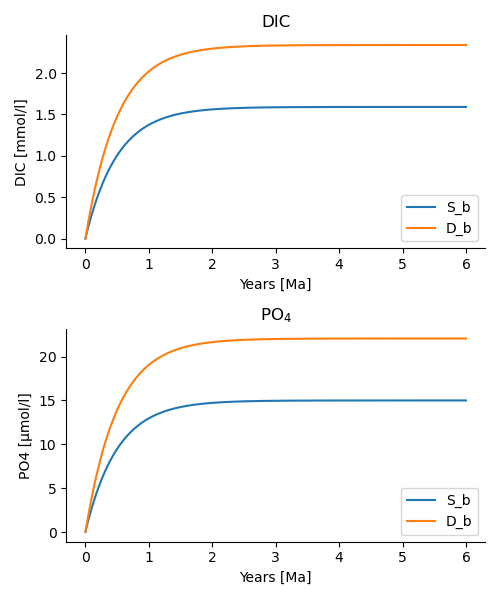
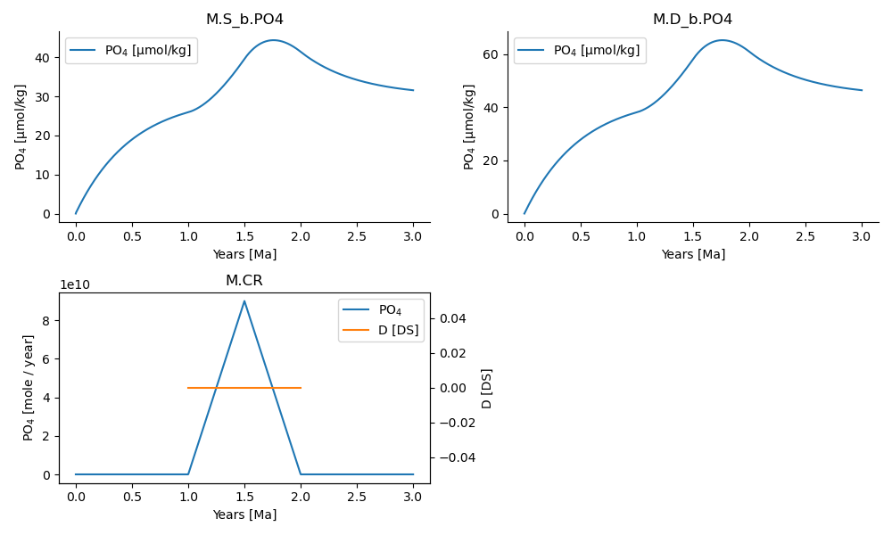

#+options: toc:nil author:nil num:nil
#+number-offset: 5

* Adding Complexity

** Working with multiple species

The basic building blocks introduced so far are sufficient to create a single-species model. Adding further species is straightforward. The primary
difference is that reservoirs, sources, sinks, and connections must now specify which species they contain or transport.

In the example below, we extend the previous simple P-cycle model into a multispecies model by expressing phosphorus cycling as a function of organic matter (OM) production and remineralization. Organic matter production is represented using a fixed C:P Redfield ratio so that carbon export is linked directly to phosphorus uptake.

The complete example is available as =po4_3.py= in the ESBMTK-Examples repository.

*** Defining the Model instance 

We begin by defining the model instance and register the required species definitions. Multiple species can be registered in the model by simply extending the list of elements, as shown below:

#+name: po43_1
#+BEGIN_SRC ipython :tangle po4_3.py
from esbmtk import (
    Model,
    Reservoir,  # the reservoir class
    ConnectionProperties,  # the connection class
    SourceProperties,  # the source class
    SinkProperties,  # sink class
    data_summaries,
    Q_,
)

M = Model(
    stop="6 Myr",  # end time of model
    max_timestep="1 kyr",  # upper limit of time step
    element=["Phosphor", "Carbon"],  # list of species definitions
)

# boundary conditions
F_w_PO4 =  M.set_flux("45 Gmol", "year", M.PO4) # P @280 ppm (Filipelli 2002)
tau = Q_("100 year")  # PO4 residence time in surface boxq
F_b = 0.01  # About 1% of the exported P is buried in the deep ocean
thc = "20*Sv"  # Thermohaline circulation in Sverdrup
Redfield = 106 # C:P
#+END_SRC

Similarly, multiple species can be registered with the source, sink, and reservoir objects, by extending the lists and dictionaries associated with species or concentrations keywords. 

#+name: po43_2
#+BEGIN_SRC ipython :tangle po4_3.py
SourceProperties(
    name="weathering",
    species=[M.PO4, M.DIC], #multi-species syntax
)
SinkProperties(
    name="burial",
    species=[M.PO4, M.DIC], #multi-species syntax
)
Reservoir(
    name="S_b",
    volume="3E16 m**3",  # surface box volume
    concentration={M.DIC: "0 umol/l", M.PO4: "0 umol/l"}, #multi-species syntax
)
Reservoir(
    name="D_b",
    volume="100E16 m**3",  # deep box volume
    concentration={M.DIC: "0 umol/l", M.PO4: "0 umol/l"}, #multi-species syntax
)
#+END_SRC

*** Transporting Multiple Species

Connections created between reservoir groups using =ConnectionProperties= automatically apply to every species contained within those groups unless an explicit species list is supplied.

For example, thermohaline circulation can be applied simultaneously to both DIC and PO4 by connecting the reservoir groups via =ConnectionProperties=.

#+name:po43_3
#+BEGIN_SRC ipython :tangle po4_3.py
ConnectionProperties(  # thermohaline downwelling
    source=M.S_b,  # source of flux
    sink=M.D_b,  # target of flux
    ctype="scale_with_concentration",
    scale=thc,
    id="thc_up",
)
ConnectionProperties(  # thermohaline upwelling
    source=M.D_b,  # source of flux
    sink=M.S_b,  # target of flux
    ctype="scale_with_concentration",
    scale=thc,
    id="thc_down",
)
#+END_SRC

If different species require different transport rates, the =rate= (or =scale=) keyword can instead be provided as a dictionary.

For example,

#+name:po43_4
#+BEGIN_SRC ipython :tangle po4_3.py
ConnectionProperties(
    source=M.weathering,  # source of flux
    sink=M.S_b,  # target of flux
    rate={M.DIC: F_w_PO4 * Redfield, M.PO4: F_w_PO4},  # rate of flux
    ctype="regular",
    id="weathering",  # connection id
)
#+END_SRC

Connections may also use one species to determine the transport rate of another. This is done using the =ref_reservoirs= or =ref_flux= keywords.

For example, the code below links organic carbon production to phosphate uptake using a fixed Redfield ratio.

#+name:po43_5
#+BEGIN_SRC ipython :tangle po4_3.py
# P-uptake by photosynthesis
ConnectionProperties(  #
    source=M.S_b,  # source of flux
    sink=M.D_b,  # target of flux
    ctype="scale_with_concentration",
    scale=M.S_b.volume / tau,
    id="primary_production",
    species=[M.PO4],  # apply this only to PO4
)
# OM Primary production as a function of P-concentration
ConnectionProperties(  #
    source=M.S_b,  # source of flux
    sink=M.D_b,  # target of flux
    ref_reservoirs=M.S_b.PO4,
    ctype="scale_with_concentration",
    scale=Redfield * M.S_b.volume / tau,
    species=[M.DIC],
    id="OM_production",
)
# P burial 
ConnectionProperties(  #
    source=M.D_b,  # source of flux
    sink=M.burial,  # target of flux
    ctype="scale_with_flux",
    ref_flux=M.flux_summary(filter_by="primary_production",return_list=True)[0],
    scale={M.PO4: F_b, M.DIC: F_b * Redfield},
    id="burial",
)
#+END_SRC
One can now proceed to define the particulate phosphate transport as a function of organic matter export
#+BEGIN_SRC ipython :tangle po4_3.py
M.run()
pl = data_summaries(
    M,  # model instance 
    [M.DIC, M.PO4],  # SpeciesProperties list 
    [M.S_b, M.D_b],  # Reservoir list
)
M.plot(pl, fn="po4_3.png")
#+END_SRC
which results in the below plot. The full code is available in the examples directory as =po4_2.py=
#+attr_org: :width 300
#+attr_rst: :width 400
#+attr_latex: :width 0.5\textwidth
#+name: po4_2
#+caption: Output of =po4_3.py= demonstrating the use of the 
#+caption: =data_summaries()= function

# Build a testcase
#+BEGIN_SRC ipython :noweb yes :tangle po4_3_test.py :exports none
<<po43_1>>
<<po43_2>>
<<po43_3>>
<<po43_4>>
<<po43_5>>
M.run()
#+END_SRC

# create unit test
#+BEGIN_SRC ipython :noweb yes :tangle test_po4_3.py :exports none
import pytest
import po4_3_test  # import script

M = po4_3_test.M  # get model handle 
test_values = [ # result, reference value
    (M.S_b.PO4.c[-1]*1e6, 14.99),
    (M.S_b.DIC.c[-1]*1e6, 1589.98),
    (M.D_b.PO4.c[-1]*1e6, 22.05),
    (M.D_b.DIC.c[-1]*1e6, 2338.18),
]
<<testrunner>>
#+END_SRC

** Using many boxes
Using the ESBMTK classes introduced thus far is sufficient to build complex models. However, it is beneficial to leverage Python syntax to create utility functions that help reduce overly verbose code. The ESBMTK library includes several routines that aid in this process; however, they are not part of the core API, are not yet well documented, and have not undergone extensive testing. The following provides a brief introduction, but it may be useful to examine the code for the Boudreau 2010 model in the example directory, as it makes significant use of the Python dictionary class.

For these functions to operate correctly, box names must adhere to the following template: =Area_depth=, such as =L_sb= for a low latitude surface water box or =D_db= for a deep water box. While the actual names are flexible, the underscore is utilized to distinguish between ocean area (eg. low-latitude, high-latitude, etc.) and depth interval (eg. surface, intermediate, deep, etc.). 

The following code examples demonstrate how to create multiple boxes simultaneously by first defining a dictionary containing the box geometry and initial values, followed by the @@rst::py:class:`esbmtk.utility_functions.initialize_reservoirs()`@@ function to instantiate the corresponding =Reservoir= objects. The =Boudreau2010.py= example available at https://github.com/uliw/ESBMTK-Examples illustrates a practical application of this approach.
#+BEGIN_SRC ipython
box_parameters: dict = {  # name: [[geometry], T, P]
    "H_b": {  # High-Lat Box
        "c": {
            M.DIC: "2153 umol/kg",
            M.TA: "2345 umol/kg",
            M.PO4: "1.5 umol/kg",
            M.O2: "200 umol/kg",
        },
        "g": {"area": "0.5e14m**2", "volume": "1.76e16 m**3"},  # geometry
        "T": 2,  # temperature in C
        "P": 17.6,  # pressure in bar
        "S": 35,  # salinity in psu
    },
    "L_b": {  # Low-Lat Box
        "c": {
            M.DIC: "1952 umol/kg",
            M.TA: "2288 umol/kg",
            M.PO4: "1.5 umol/kg",
            M.O2: "200 umol/kg",
        },
        "g": {"area": "2.85e14m**2", "volume": "2.85e16 m**3"},
        "T": 21.5,
        "P": 5,
        "S": 35,
    },
# Instantiate Reservoir objects        
species_list = initialize_reservoirs(M, box_parameters)
#+END_SRC
Similarly, we can leverage  Python dictionaries to set up the transport matrix. The dictionary key must use the following template: =boxname_to_boxname@id= where the =id= is used similarly to the connection id in the =Species2Species= and =ConnectionProperties= classes. 

So to specify, for example, thermohaline upwelling from the Atlantic deep water to the Atlantic intermediate water, you would use =A_db_to_A_ib@thc=  as the dictionary key, followed by the rate. The following examples define the thermohaline transport in a LOSCAR-type model (based on https://gmd.copernicus.org/articles/5/149/2012/):

#+BEGIN_SRC ipython
# Conveyor belt
thc = Q_("20*Sv")
ta = 0.2  # upwelling coefficient Atlantic ocean
ti = 0.2  # upwelling coefficient Indian ocean

# Specify the mixing and upwelling terms as dictionary
thx_dict = {  # Conveyor belt
    "H_sb_to_A_db@thc": thc,
    # Upwelling
    "A_db_to_A_ib@thc": ta * thc,
    "I_db_to_I_ib@thc": ti * thc,
    "P_db_to_P_ib@thc": (1 - ta - ti) * thc,
    "A_ib_to_H_sb@thc": thc,
    # Advection
    "A_db_to_I_db@adv": (1 - ta) * thc,
    "I_db_to_P_db@adv": (1 - ta - ti),
    "P_ib_to_I_ib@adv": (1 - ta - ti),
    "I_ib_to_A_ib@adv": (1 - ta) * thc,
}
#+END_SRC
to create the actual connections we need to:
 1. Assemble a list of all species that are affected by thermohaline circulation
 2. Specify the connection type that describes thermohaline transport, i.e., =scale_by_concentration=
 3. Combine #1 & #2 into a dictionary that can be used by the =create_bulk_connections()= function to instantiate the necessary connections.
#+BEGIN_SRC ipython
species_names = list(ic.keys())  # get species list
connection_type = {"ty": "scale_with_concentration", "sp": sl}
connection_dictionary = build_ct_dict(thx_dict, species_names)
create_bulk_connections(connection_dictionary, M, mt="1:1")
#+END_SRC

In the following example, we build the =connection_dictionary= in a more explicit way to define primary production as a function of P upwelling: the first line finds all the upwelling fluxes, and we can then use them as an argument in the =connection_dictionary= definition:
#+BEGIN_SRC ipython
# get all upwelling P fluxes except for the high latitude box
pfluxes = M.flux_summary(filter_by="PO4_mix_up", exclude="H_", return_list=True)

# define export productivity in the high latitude box
PO4_ex = Q_(f"{1.8 * M.H_sb.area/M.PC_ratio} mol/a") #PC ratio = Phosphorus:Carbon ratio

c_dict = {  # Surface box to ib, about 78% is remineralized in the ib
    ("A_sb_to_A_ib@POM_P", "I_sb_to_I_ib@POM_P", "P_sb_to_P_ib@POM_P"): {
        "ty": "scale_with_flux",
        "sc": M.PUE * M.ib_remin, #PUE = Phosphorus Utilization Efficiency 
        "re": pfluxes,
        "sp": M.PO4,
    },  # surface box to deep box
    ("A_sb_to_A_db@POM_P", "I_sb_to_I_db@POM_P", "P_sb_to_P_db@POM_P"): {
        "ty": "scale_with_flux",
        "sc": M.PUE * M.db_remin,
        "re": pfluxes,
        "sp": M.PO4,
    },  # high latitude box to deep ocean boxes POM_P
    ("H_sb_to_A_db@POM_P", "H_sb_to_I_db@POM_P", "H_sb_to_P_db@POM_P"): {
        # here we use a fixed rate following Zeebe's Loscar model
        "ra": [
            PO4_ex * 0.3,
            PO4_ex * 0.3,
            PO4_ex * 0.4,
        ],
        "sp": M.PO4,
        "ty": "Fixed",
    },
}
create_bulk_connections(c_dict, M, mt="1:1")
#+END_SRC

In the last example, we use the =gen_dict_entries= function to extract a list of connection keys that can be used in the =connection_dictionary= . The following code finds all connection keys that match the particulate organic phosphor fluxes (=POM_P=) defined in the code above, and to replace them with a connection key that uses =POM_DIC= as id-string. The function returns a list of fluxes and matching keys that can be used to specify new connections. See also =boudreau2010.py= which uses a less complex setup (https://github.com/uliw/ESBMTK-Examples).
#+BEGIN_SRC ipython
keys_POM_DIC, ref_fluxes = gen_dict_entries(M, ref_id="POM_P", target_id="POM_DIC")

c_dict = {
    keys_POM_DIC: {
        "re": ref_fluxes,
        "sp": M.DIC,
        "ty": "scale_with_flux",
        "sc": M.PC_ratio,
        "al": M.OM_frac,
    }
}
create_bulk_connections(c_dict, M, mt="1:1")
#+END_SRC

** Using Excel sheets for model definitions

For models with many reservoirs and transport connections, creating reservoir and connections using python dictionaries can become repetitive and difficult to maintain. ESBMTK therefore provides helper functions that read reservoir and transport matrix definitions directly from Excel workbooks. These helper functions include:
- =create_reservoirs_from_excel=
- =create_transport_matrix_from_excel=
- =create_gas_reservoirs_from_excel=
- =create_gas_exchange_connections_from_excel=
Which can be used to initialize ocean reservoirs, transport matrix, atmospheric reservoirs, and air-sea gas-exchange connections respectively using an excel sheet (.xlsx or .odf). 

The functions =create_reservoirs_from_excel= and =create_transport_matrix_from_excel= are described in further detail below. 

For more information on =create_gas_reservoirs_from_excel= and =create_gas_exchange_connections_from_excel=, please see the manual's section on [[https://esbmtk.readthedocs.io/en/latest/manual/manual-4.html#gas-exchange][gas exchange]].

Notes:
- Column names must /exactly/ match the expected names described below.
- Reservoir names used in the worksheets must match those used in the model.
- Any variables specified herein must also be defined in the python model file. 
- Numerical values may be entered directly or calculated using standard Excel formulas.

*** Creating reservoirs from Excel

The function =create_reservoirs_from_excel= creates ocean reservoirs, sources, and sinks from information provided in an Excel file. 

Each row in the excel table represents one reservoir definition. Reservoir geometry, temperature, pressure, and salinity, initial species concentrations, and initial isotope compositions can be specified as columns, as shown in the example table below:

|name | type | z_top | z_bottom | area_percentage | temperature | pressure | salinity | DIC | delta_DIC |
|-----+------+------+----------+-----------------+-------------+----------+----------+-----+-------+----+----|
| A_sb | reservoir| 0| -100	| 0.26	| 20	| 5	| 34.7	| 2210	|  2 |
| A_ib |reservoir |-100	|-1000	|0.26	|10	|100	|34.7	|2210	| 2 | 
| A_db |reservoir|-1000	|-6000	|0.26	|2	|240	|34.7	|2210	| 2 |
| Fw | source| | | | | | | | | 
| Fb	| sink| | | | | | | | | 

Ocean reservoir rows necessarily require the =name=, =type=, and geometry columns (=z_top=, =z_bottom=, and =area_percentage=), whereas only the =name= and =type= columns are necessary for the source and sink reservoirs. Default temperature, pressure, and salinity values can be specified as a function parameter.

Isotope compositions can optionally be specified using columns named =delta_[species]=. For example, the column =delta_DIC= specifies the initial \delta^{13}C isotopic composition of any given reservoir. Note that isotopes are not initialized for reservoirs for which the isotope column is left blank (e.g., =Fw= and =Fb= in the table above).

Important: at present, isotopes must be initialized separately for the Source and Sink. This can be done as shown in the function call example below.

The function can be called as follows:

#+BEGIN_SRC ipython

#----- Isotope ratios ----- #
M.Fw_DIC_d = 1.5  # Carbonate weathering delta
M.Fb_DIC_d = 0 # burial delta (included for isotope initialization in Sink) 

#---- Create reservoirs from excel ----#
species_list = create_reservoirs_from_excel(
        M, #Model object
        "LOSCAR_sheets.xlsx", #specify Excel file name / file path
        sheet_name="reservoirs" #specify Excel worksheet (default = "reservoirs")
        )

#---- Separately initialize reservoirs for Source and Sink ----#
M.Fw.DIC.delta = M.Fw_DIC_d #initialize delta for Source object
M.Fb.DIC.delta = M.Fb_DIC_d #initialize delta for Sink object
#+END_SRC

Notes:
- The function only accepts reservoir geometry information provided via the =z_top=, =z_bottom=, and =area_percentage= parameters at present. 
- Species columns are detected automatically from species registered in the model. 
- Species concentrations are assumed to be in umol/kg, unless otherwise specified. 
- Only isotope columns corresponding to species registered in the model are permitted; otherwise an error is raised.

*** Creating transport matrices from Excel

The function =create_transport_matrix_from_excel= creates mixing and thermohaline transport connections between reservoirs via a worksheet. Each row defines a single connection. 

Required excel columns:
- =source= 
- =sink=
- =flux_id=
- =sc= 

Example rows and columns may look like the following:

| source |sink	| flux_id	| sc| 
| H_sb| 	A_db |	thermohaline	| thc|
|A_ib	|A_sb	|mix_up	|21 Sverdrup|

The scaling factor =sc= may be specified in Sverdrups (e.g., “10 Sverdrup”) or as a variable defined within the python file (e.g., =thc=).

Note: mixing fluxes are symmetric, so for each mix_up flux, a corresponding “mix_down” flux does not need to be specified and will be created automatically. 

The function can be called as follows:

#+BEGIN_SRC ipython
create_transport_matrix_from_excel(
        M, #Model object
        "LOSCAR_sheets.xlsx", #specify file path
        species_list, #list of species being transported via advection and mixing
        sheet_name="transport_matrix" #specify worksheet (default = "transport_matrix")
        )
#+END_SRC

It is recommended to check out the =LOSCAR_2012= directory in [[https://github.com/uliw/ESBMTK-Examples/tree/main][ESBMTK-Examples]] for a detailed example of the functions described above.
** Model forcing
ESBMTK realizes model forcing through the @@rst::py:class:`esbmtk.extended_classes.Signal()`@@ class. Once defined, a signal instance can be associated with a @@rst::py:class:`esbmtk.connections.Species2Species()`@@ instance that will then act on the associated connection. This class provides the following keywords to create a signal:

- =square()=, =pyramid()=, =bell()=  These are defined by specifying the signal start time (relative to the model time), its size (as mass) and duration, or as duration and magnitude (see the example below)
- =filename()= a string pointing to a CSV file that specifies the following columns: =Time [yr]=, =Rate/Scale [units]=, =delta value [dimensionless]= The class will attempt to convert the data into the correct model units. This process is however not very robust.

The default is to add the signal to a given connection. It is however also possible to use the signal data as a scaling factor. Signals are cumulative, i.e., complex signals are created by adding one signal to another (i.e., Snew = S1 + S2). Using the P-cycle model from the previous chapter (see =po4_1.py=) we can add a signal by first defining a signal instance, and then associating the instance with a weathering connection instance (this model is available as =po4_2.p4= see https://github.com/uliw/ESBMTK-Examples)
# import the model code from manual-1
#+name:po42_1
#+BEGIN_SRC ipython :noweb yes :tangle po4_2.py :exports none
<<manual-1.org:po41definition()>>
#+END_SRC

#+name:po42_2
#+BEGIN_SRC ipython :tangle po4_2.py
from esbmtk import Signal

Signal(
    name="CR",  # Signal name
    species=M.PO4,  # SpeciesProperties
    start="1 Myrs",
    shape="pyramid",
    duration="1 Myrs",
    mass="45 Pmol",
)

ConnectionProperties(
    source=M.weathering,  # source of flux
    sink=M.S_b,  # target of flux
    rate=F_w,  # rate of flux
    id="river",  # connection id
    signal=M.CR,
    species=[M.PO4],
    ctype="regular",
)
M.run()
#+END_SRC
Note that the =plot()= method accepts the signal object as well. In general, any ESBMTK object that has data that varies with time, can be plotted by the =plot()= method. ESBMTK also provides classes to include
external data  @@rst::py:class:`esbmtk.extended_classes.ExternalData()`@@   as well as classes to mix and match data into the same plot @@rst::py:class:`esbmtk.extended_classes.DataField()`@@. The file =is92a_comparison_plots.py= (see  https://github.com/uliw/ESBMTK-Examples/tree/main/Boudreau/2010) shows a use case. Furthermore, @@rst::py:class:`esbmtk.model.Model.plot()`@@  returns a tuple with the figure instance, list of =axs= objects, which allows even more complex figure manipulations (see =steady_state_plots.py= in the same repository).
#+BEGIN_SRC ipython :tangle po4_2.py
M.plot([M.S_b.PO4, M.D_b.PO4, M.CR], fn="po4_2.png")
#  M.save_data()
#+END_SRC

This will result in the following output:
#+attr_org: :width 300
#+attr_rst: :width 400
#+attr_latex: :width 0.5\textwidth
#+name: pcycle
#+name: sig
#+caption: Example output for the =CR= signal above. See =po4_2.py=
#+caption: in the examples directory.

#+BEGIN_SRC org :noweb yes :tangle po4_2_test.py :exports none
<<po42_1>>
<<po42_2>>
#+END_SRC

# define a test function
#+name: testrunner
#+BEGIN_SRC ipython :exports none
# run tests
@pytest.mark.parametrize("test_input, expected", test_values)
def test_values(test_input, expected):
    t = 1e-1 # +- 1 mu mol is good enough 
    assert abs(expected) * (1 - t) <= abs(test_input) <= abs(expected) * (1 + t)
#+END_SRC

# define a testcase
#+BEGIN_SRC ipython :noweb yes :tangle test_po4_2.py :exports none
import pytest
import po4_2_test  # import script

M = po4_2_test.M  # get model handle 
test_values = [ # result, reference value
    (M.S_b.PO4.c[-1]*1e6, 31.55),
    (M.D_b.PO4.c[-1]*1e6, 46.40),
]
<<testrunner>>
#+END_SRC

*** Signal data structure 
The original signal data (as read from a csv etc.) is available through the =.s_time=, =.s_data= instance variables. The padded/cropped data that is interpolated for each time point, is stored in the =.cd_m= (and =.cd_l= if isotope data is present) instance variables.The sub-sampled signal data that is used for plotting is stored in =.m=, =.l= and =.d= respectively.  Signal data can also be queried interactively by calling the signal with a given time values, e.g., =M.PO4_signal(12)=. 

*** Applying a signal to multiple connections 
Adding signals is a computationally expensive process due to the involvement of multiple function calls. When the same signal shape is used to modify multiple connections, it is more efficient to create a placeholder connection with the signal and then use a =scale_with_flux= connection type to reference the placeholder flux. This approach has the added advantage that each =scale_with_flux= connection can set its own scaling factor.
#+BEGIN_SRC ipython
# read the forcing (signal) data
M.PW_SO4_Koelling = Signal(
    name="PW_SO4_Koelling",
    species=M.SO4,
    filename="koelling_pyrite_data_3Ma_w_isotopes.csv",
    stype="addition",
    register=M,
)

# Create a placeholder flux that does not affect the model 
# and connect the signal data 
Species2Species(
    ctype="regular",
    source=M.Fw.SO4,
    sink=M.Fb.SO4,
    signal=M.PW_SO4_Koelling,
    id="signal_as_flux",
)

Species2Species(
    ctype="scale_with_flux",
    id="actual_flux",
    source=M.Fw.SO4,
    sink=M.L_b.SO4,
    ref_flux="signal_as_flux",
    scale=3, 
)
#+END_SRC

*** Signals and isotopes 
Signal data can be applied to isotope effects as well. For this you need to specify a second column in the signal data file that contains delta values with a header like this =d34S [dimensionless]=. The data is interpreted according to the connection setting. I.e., if the connection specifies a delta-value, the third column will be interpreted as delta value (ditto for epsilon values).

Isotope effects are always additive. I.e., If there is a flux A, and a signal B, ESBMTK will calculate the isotope effects for A according to the delta/epsilon value that is set in the connection properties, and the calculate the isotope effects for the  signal flux based on the values delta/epsilon values in the signal data file.
