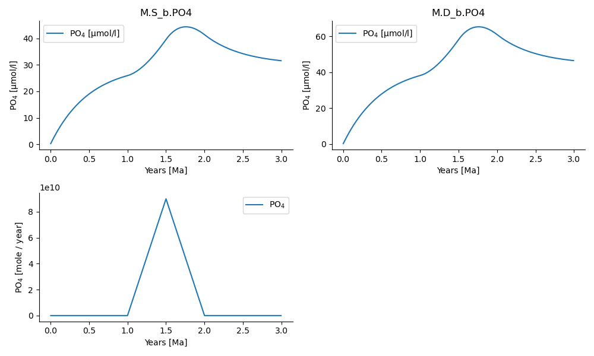

=============
ESBMTK Manual
=============

1 Implementing more complex models
----------------------------------

1.1 Adding model forcing
~~~~~~~~~~~~~~~~~~~~~~~~

ESBMTK realizes model forcing through the :py:class:`esbmtk.extended_classes.Signal()` class. Once defined, a signal instance can be associated with a :py:class:`esbmtk.connections.Connection()` instance that will then act on the associated connection. This class provides the following keywords to create a signal:

- ``square()``, ``pyramid()``, ``bell()``  These are defined by specifying the signal start time (relative to the model time), its size (as mass) and duration, or as duration and magnitude (see the example below)

- ``filename()`` a string pointing to a CSV file that specifies the following columns: ``Time [yr]``, ``Rate/Scale [units]``, ``delta value [dimensionless]`` The class will attempt to convert the data into the correct model units. This process is however not very robust.

The default is to add the signal to a given connection. It is however also possible to use the signal data as a scaling factor. Signals are cumulative, i.e., complex signals are created by adding one signal to another (i.e., Snew = S1 + S2). Using the P-cycle model from the previous chapter (see ``po4_1.py`` in the examples directory) we can add a signal by first defining a signal instance, and then associating the instance with a weathering connection instance:

.. code:: ipython

    Signal(
        name="CR",  # Signal name
        species=M.PO4,  # Species
        start="3 Myrs",
        shape="pyramid",
        duration="1 Myrs",
        mass="45 Pmol",
        register=M,
    )

    Connection(
        source=M.weathering,  # source of flux
        sink=M.sb,  # target of flux
        rate=F_w,  # rate of flux
        id="river",  # connection id
        signal=M.CR,
    )

This will result in the following output:

.. _sig:

.. figure:: ./po4_1_with_signal.png
    :width: 300

    Example output for the ``CR`` signal above. See ``po4_1_with_signal.py`` in the examples directory.

1.2 Working with multiple species
~~~~~~~~~~~~~~~~~~~~~~~~~~~~~~~~~

The basic building blocks introduced so far, are sufficient to create a model, but not necessarily convenient when a model contains more than one species. ESBMTK addresses this through the :py:class:`esbmtk.extended_classes.ReservoirGroup.()` class, which allows to group of several :py:class:`esbmtk.esbmtk.Reservoir()` instances.
instances. A  ``ReservoirGroup`` shares common properties. e.g., the volume and name of a given box, as well as the connection properties. In other words, in a multi-species model, one does not have to specify connections for each species, rather, it is sufficient to specify the connection type for the  ``ReservoirGroup`` instance. Similarly, there are classes to group sources, sinks and connections.

Using the previous example of a simple P-cycle model, we now express the P-cycling as a function of photosynthetic organic matter (OM) production and remineralization. First, we import the new classes and we additionally load the species definitions for carbon.

.. code:: ipython

    from esbmtk import (
        ReservoirGroup,  # the reservoir class
        ConnectionGroup,  # the connection class
        SourceGroup,  # the source class
        SinkGroup,  # sink class
    )
    M = Model(
        stop="6 Myr",  # end time of model
        timestep="1 kyr",  # upper limit of time step
        element=["Phosphor", "Carbon"],  # list of species definitions
    )

Setting up a group source, is similar to a single Source, except that we now specify a species list:

.. code:: ipython

    SourceGroup(
        name="weathering",
        species=[M.PO4, M.DIC],
        register=M,  # i.e., the instance will be available as M.weathering
    )

Defining a ``Reservoirgroup`` follows the same pattern, except that we use a dictionary so that we can specify the initial concentrations for each species as well:

.. code:: ipython

    ReservoirGroup(
        name="S_b",
        volume="3E16 m**3",  # surface box volume
        concentration={M.DIC: "0 umol/l", M.PO4: "0 umol/l"},
        register=M,
    )

The :py:class:`esbmtk.connections.ConnectionGroup.()` class definition is equally straightforward, and the following expression will apply the thermohaline downwelling to all species in the ``M.S_b`` group.

.. code:: ipython

    ConnectionGroup(  # thermohaline downwelling
        source=M.S_b,  # source of flux
        sink=M.D_b,  # target of flux
        ctype="scale_with_concentration",
        scale=thc,
        id="downwelling_PO4",
    )

It is also possible, to specify individual rates or scales using a dictionary, as in this example that sets two different weathering fluxes:

.. code:: ipython

    ConnectionGroup(
        source=M.weathering,  # source of flux
        sink=M.S_b,  # target of flux
        rate={M.DIC: F_w_OM, M.PO4: F_w_PO4},  # rate of flux
        ctype="regular",
        id="river",  # connection id
    )

The following code defines primary production and its effects on DIC in the surface and deep box. The example is a bit contrived but demonstrates the principle. Note the use of the ``ref_reservoirs`` keyword and ``Redfield`` ratio

.. code:: ipython

    # Primary production as a function of P-concentration
    Connection(  #
        source=M.S_b.DIC,  # source of flux
        sink=M.D_b.DIC,  # target of flux
        ref_reservoirs=M.S_b.PO4,
        ctype="scale_with_concentration",
        scale=Redfield * M.S_b.volume / tau,
        id="OM_production",
    )

One can now proceed to define the particulate phosphate transport as a function of organic matter export

.. code:: ipython

    pl = data_summaries(
        M,  # model instance 
        [M.DIC, M.PO4],  # Species list 
        [M.S_b, M.D_b],  # ReservoirGroup list
        M,
    )
    M.plot(pl, fn="po4_2.png")

which results in the below plot. The full code is available in the examples directory as ``po4_2.py``

.. _po4_2:

    Output of ``po4_2.py`` demonstrating the use of the ``data_summaries()`` function

1.3 Adding isotopes
~~~~~~~~~~~~~~~~~~~

Let's assume that the weathering flux of carbon has :math:`\delta`\ :sup:`13`\C value of 0 mUr, that photosynthesis, fractionates by -28 mUr, and that organic matter burial does not import any  carbon isotope fractionation. These changes require the following changes to the previous model code (the full code is available in the examples directory as ``po4_2_with_isotopes.py``):

1. Isotope ratios require non-zero concentrations to avoid a division by zero,

2. You need to specify the initial isotope ratio for each reservoir

3. You need to indicate for each reservoir that ``DIC`` requires isotope calculations

4. we need to specify the isotope ration of the weathering flux

5. we need to specify the fractionation factor during photosynthesis

.. code:: ipython

    # 1, 2 & 3 and similar forf the deep ocean box
    ReservoirGroup(
        name="S_b",
        register=M,
        volume="3E16 m**3",  # surface box volume
        concentration={M.DIC: "1 umol/l", M.PO4: "0 umol/l"},
        isotopes={M.DIC: True},
        delta={M.DIC: 0},
    )

    # 4 weathering flux
    ConnectionGroup(
        source=M.weathering,  # source of flux
        sink=M.S_b,  # target of flux
        rate={M.DIC: F_w_OM, M.PO4: F_w_PO4},  # rate of flux
        delta={M.DIC: 0},
        ctype="regular",  # required!
        id="weathering",  # connection id
    )

    # 5 photosynthesis
    Connection(  #
        source=M.S_b.DIC,  # source of flux
        sink=M.D_b.DIC,  # target of flux
        ref_reservoirs=M.S_b.PO4,
        ctype="scale_with_concentration",
        scale=Redfield * M.S_b.volume / tau,
        id="OM_production",
        alpha=-28,  # mUr
    )

Running the previous model with these additional 5 lines, results in the following graph. Note that the run-time has been reduced to 500 years, so that the graph does not just show the steady state, and that the P-data is not shown.

.. _po4_2_with_isotopes:

.. figure:: ./po4_2_with_isotopes.png
    :width: 300

    Output of ``po4_2_with_isotopes``.py= Note that the run-time has been reduced to 500 years, so that the graph does not just show the steady state. The upper box shows the gradual increase in DIC concentrations, and the lower shows the corresponding isotope ratios. The system will achieve isotopic equilibrium within approximately 2000 years.

1.4 Using many boxes
~~~~~~~~~~~~~~~~~~~~

Using the ESBMTK classes introduced so far, is sufficient to build complex models. However, it is easy to leverage pythons syntax to create a few utility functions that help in reducing overly verbose code. The esbmtk library comes with a few routines that help in this regard. However, they are not part of the core API, are not (yet) well documented and have not seen much testing. The following provides a brief introduction, but it may be useful to study the code for the Boudreau 2010 and LOSCAR-type  model in the example directory. All of these make heavy use of the Python dictionary class.

In order for this functions to work correctly, box-names need to be specified following this template ``Area_depth``, e.g., ``A_sb`` for the Atlantic surface water box, or ``A_ib`` for the Atlantic intermediate water box. The actual names, do not matter, but the underscore is used to differentiate between ocean area, and depth interval. The following code uses two dictionaries to specify the species an initial conditions for a multibox model.Both dictionaries are then used as input for a function that creates the actual instances. Note that the meaning and syntax for the geometry list and seawater parameters are explained in the next chapter.

.. code:: ipython

    # ud = upper depth datum, ld = lower depth datum, ap = area percentage
    # T = Temperature (C), P = Pressure (bar), S = Salinity in PSU 
    """
    box_parameters = {  # name: [[ud, ld ap], T, P, S]
            # Atlantic Ocean
            "M.A_sb": {"g": [0, -100, A_ap], "T": 20, "P": 5, "S": 34.7},
            "M.A_ib": {"g": [-100, -1000, A_ap], "T": 10, "P": 100, "S": 34.7},
            "M.A_db": {"g": [-1000, -6000, A_ap], "T": 2, "P": 240, "S": 34.7},
            # Indian Ocean
            "I_sb": {"g": [0, -100, I_ap], "T": 20, "P": 5},
            "I_ib": {"g": [-100, -1000, I_ap], "T": 10, "P": 100, "S": 34.7},
            "I_db": {"g": [-1000, -6000, I_ap], "T": 2, "P": 240, "S": 34.7},
            # Pacific Ocean
            "P_sb": {"g": [0, -100, P_ap], "T": 20, "P": 5, "S": 34.7},
            "P_ib": {"g": [-100, -1000, P_ap], "T": 10, "P": 100, "S": 34.7},
            "P_db": {"g": [-1000, -6000, P_ap], "T": 2, "P": 240, "S": 34.7},
            # High latidude box
            "H_sb": {"g": [0, -250, H_ap], "T": 2, "P": 10, "S": 34.7},
            # Weathering sources
            "Fw": {"ty": "Source", "sp": [M.DIC, M.TA, M.PO4]},
            # Burial Sinks
            "Fb": {"ty": "Sink", "sp": [M.DIC, M.TA, M.PO4]},
        }

    initial_conditions= {
            # species: [concentration, Isotopes, delta value]
            M.PO4: [Q_("2.1 * umol/kg") * 1.024, False, 0],
            M.DIC: [Q_("2.21 mmol/kg") * 1.024, True, 2],
            M.TA: [Q_("2.31 mmol/kg") * 1.024, False, 0],
            M.O2: [Q_("200 umol/kg") * 1.024, False, 0],
        }

    create_reservoirs(box_names, initial_conditions, M)

similarly we can leverage a Python dictionaries to setup the transport matrix. The dictionary key must use the following template: ``boxname_to_boxname@id`` where the ``id`` is used similarly to the connection id in the ``Connection`` and ``ConnectionGroup`` classes. So to specify thermohaline upwelling from the Atlantic deep water to the Atlantic intermediate water you would use ``A_db_to_A_ib@thc``  as the dictionary key, followed by the rate. The following examples defines the thermohaline transport in a LOSCAR type model:

.. code:: ipython

    # Conveyor belt
    thc = Q_("20*Sv")
    ta = 0.2  # upwelling coefficient Atlantic ocean
    ti = 0.2  # upwelling coefficient Indian ocean

    # Specify the mixing and upwelling terms as dictionary
    thx_dict = {  # Conveyor belt
        "H_sb_to_A_db@thc": thc * M.H_sb.swc.density / 1e3,
        # Upwelling
        "A_db_to_A_ib@thc": ta * thc * M.A_db.swc.density / 1e3,
        "I_db_to_I_ib@thc": ti * thc * M.I_db.swc.density / 1e3,
        "P_db_to_P_ib@thc": (1 - ta - ti) * thc * M.P_db.swc.density / 1e3,
        "A_ib_to_H_sb@thc": thc * M.A_ib.swc.density / 1e3,
        # Advection
        "A_db_to_I_db@adv": (1 - ta) * thc * M.A_db.swc.density / 1e3,
        "I_db_to_P_db@adv": (1 - ta - ti) * thc * M.I_db.swc.density / 1e3,
        "P_ib_to_I_ib@adv": (1 - ta - ti) * thc * M.P_ib.swc.density / 1e3,
        "I_ib_to_A_ib@adv": (1 - ta) * thc * M.I_ib.swc.density / 1e3,
    }

to create the actual connections we need to:

1. Assemble a list of all species that are affected by thermohaline circulation

2. Specify the connection type that describes thermohaline transport, i.e., ``scale_by_concentration``

3. Combine #1 & #2 into a dictionary that can be used by the ``create_bulk_connections()`` function to instantiate the necessary connections.

.. code:: ipython

    species_names = list(ic.keys())  # get species list
    connection_type = {"ty": "scale_with_concentration", "sp": sl}
    connection_dictionary = build_ct_dict(thx_dict, species_names)
    create_bulk_connections(connection_dictionary, M, mt="1:1")

In the following example, we build the ``connection_dictinary`` in a more explicit way to define primary production as a function of P upwelling: The first line finds all the upwelling fluxes, and we can then use them as an argument in the ``connection_dictionary`` definition:

.. code:: ipython

    # get all upwelling P fluxes except for the high latidude box
    pfluxes = M.flux_summary(filter_by="PO4_mix_up", exclude="H_", return_list=True)

    # define export productivity in the high latidude box
    PO4_ex = Q_(f"{1.8 * M.H_sb.area/M.PC_ratio} mol/a")

    c_dict = {  # Surface box to ib, about 78% is remineralized in the ib
        ("A_sb_to_A_ib@POM_P", "I_sb_to_I_ib@POM_P", "P_sb_to_P_ib@POM_P"): {
            "ty": "scale_with_flux",
            "sc": M.PUE * M.ib_remin,
            "re": pfluxes,
            "sp": M.PO4,
        },  # surface box to deep box
        ("A_sb_to_A_db@POM_P", "I_sb_to_I_db@POM_P", "P_sb_to_P_db@POM_P"): {
            "ty": "scale_with_flux",
            "sc": M.PUE * M.db_remin,
            "re": pfluxes,
            "sp": M.PO4,
        },  # high latitude box to deep ocean boxes POM_P
        ("H_sb_to_A_db@POM_P", "H_sb_to_I_db@POM_P", "H_sb_to_P_db@POM_P"): {
            # here we use a fixed rate following Zeebe's Loscar model
            "ra": [
                PO4_ex * 0.3,
                PO4_ex * 0.3,
                PO4_ex * 0.4,
            ],
            "sp": M.PO4,
            "ty": "Regular",
        },
    }
    create_bulk_connections(c_dict, M, mt="1:1")

In the last example, we use the ``gen_dict_entries`` function to extract a list of connection keys that can be used in the ``connection_dictionary`` . The following code specifies to find all connection keys that match the particulate organic phosphor fluxes (``POM_P``) defined in the code above, and to replace them with a connection key that uses ``POM_DIC`` as id-string. The function returns a list of fluxes and matching keys that can be used to specify new connections. See also the file ``ze.py`` in the example directory that contains extensive comments. It is also recommended to read through ``boudreau2010`` which uses a less complex setup.

.. code:: ipython

    keys_POM_DIC, ref_fluxes = gen_dict_entries(M, ref_id="POM_P", target_id="POM_DIC")

    c_dict = {
        keys_POM_DIC: {
            "re": ref_fluxes,
            "sp": M.DIC,
            "ty": "scale_with_flux",
            "sc": M.PC_ratio,
            "al": M.OM_frac,
        }
    }
    create_bulk_connections(c_dict, M, mt="1:1")
