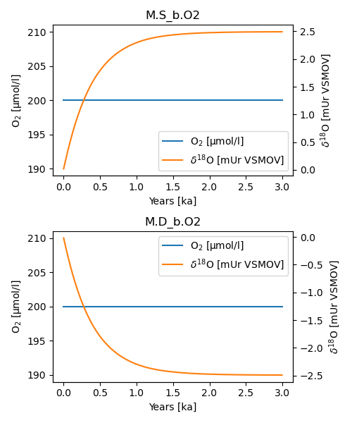

Adding isotopes
---------------

 ESBMTK support the use of isotopes for many processes and species out of the box. This is best demonstrated with an example. In the following we use tow reservoirs of equal size, and apply an exchange flux. The reservoirs have similar concentrations but their isotopic ratios are different (-20 mUr versus +20 mUr [VSMOV].  After 3 ky both reservoirs are isotopically homogeneous and have approached a :math:`\delta`\ :sup:`18`\O value of 0 mUr  [VSMOV]. Note that this only required code changes on lines 17 and 23 where declare the initial delta values.
Plotting with
results in the following output:

.. _iso1:

.. figure:: ./iso_1.png
    :width: 400

    It takes about 3 kys to equilibrate both ocean boxes.

In the next example, we use two reservoirs of equal size, and equal isotope ratios. This time, we declare that the transport from the ``D_b`` to ``S_b`` involves a fractionation of 5 mUr (line 38). Note that the fractionation has to be provided as the enrichment factor :math:`\epsilon` and not as the fractionation factor :math:`\alpha`, where 

.. math::

    \epsilon = (\alpha -1) \times 1000

Similarly to the first example, the system reaches equilibrium after about 3 kyrs. The above is then easily adapted to model, e.g., isotope fractionation during the evaporation of water.
Plotting with 
results in the following output:

.. _iso2:

    It takes about 3 kys to fully fractionate both ocean boxes.

In the last example, we model the oxygen isotope fractionation during the air-sea gas exchange. This involves kinetic fractionation during degassing, and equilibrium fractionation during gas solution. At present, ESBMTK uses the equilibrium fractionation factor parametrization of `&benson-1984-concen-isotop <&benson-1984-concen-isotop>`_

.. math::

    \alpha_eq =  1 + (-0.73 + (427 / T)) / 1000

and the kinetic fraction factor of `&knox-1992-kinet-isotop <&knox-1992-kinet-isotop>`_

.. math::

    \alpha_u =  0.9972

 
The fractionation factors for CO\ :sub:`2`\ follow the parametrization of `&Zeebe2012 <&Zeebe2012>`_.
Users can provide their own fractionation factor parametrizations by redefining the following variables after model initialization:

.. code:: jupyter-python

    M.S_b.swc.o2_a_u =  0.9972 # kinetic fractionation
    M.S_b.swc.o2_a_dg = 1.00073 # equilibrium fractionation

For carbon there a further variables that define the fractionation between CO2aq and HCO\ :sub:`3`\ \ :sup:`-`\ and HCO\ :sub:`3`\ \ :sup:`-`\ and CO\ :sub:`3`\ \ :sup:`2-`\. 
(e.g., ``...swc.CO_{2}_a_db`` and  ``...swc.CO_{2}_a_cb``  respectively).
If no such modifications are required, it is sufficient to declare the initial isotope ratio of the atmosphere (line 18) and ocean surface box.

Note however, that in order to calculate gas-exchange fluxes, we need to declare the surface area, of ``S_b`` (line 22), as well as the pressure, temperature and salinity conditions (line 25). Presently ESBMTK does not support the automatic matching of liquid species to gas reservoirs. Therefore we have to declare each gas-exchange flux individually using the ``Species2Species`` connection type (line 27 to 33). In the following example the atmosphere equilibrates withe the surface ocean with a couple of months.
plotting with
results in the following output:

.. _iso3:

.. figure:: ./iso_3.png
    :width: 400

    It takes about 3 kys to fully fractionate both ocean boxes.
