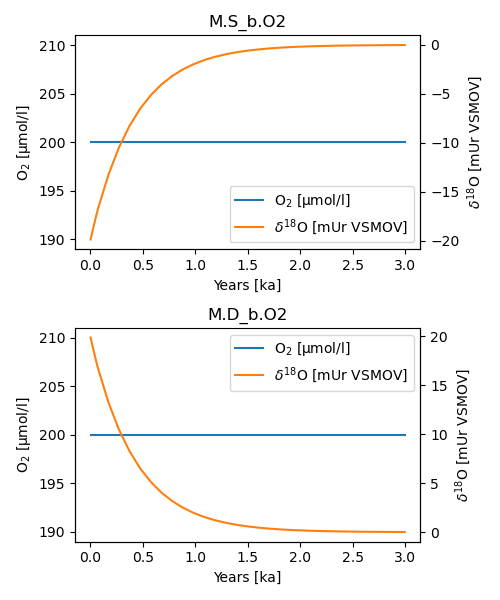
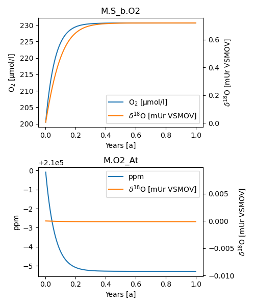

Adding isotopes
---------------

ESBMTK support the use of isotopes for many processes and species out of the box. This is best demonstrated with an example. In the following we use tow reservoirs of equal size, and apply an exchange flux. The reservoirs have similar concentrations but their isotopic ratios are different (-20 mUr versus +20 mUr [VSMOV].  After 3 ky both reservoirs are isotopically homogeneous and have approached a :math:`\delta`\ :sup:`18`\O value of 0 mUr  [VSMOV]. Note that this only required code changes on lines 17 and 23 where declare the initial delta values.

.. code:: ipython

    # This example is available as iso_1.py in ESBMTK Examples Repository
    # https://github.com/uliw/ESBMTK-Examples/tree/main/Examples_from_the_manual
    from esbmtk import (
        Model,  # the model class
        Reservoir,  # the reservoir class
        ConnectionProperties,  # the connection class
        SourceProperties,  # the source class
        SinkProperties,  # sink class
    )
    M = Model(
        stop="3 kyr",  # end time of model
        max_timestep="100 yr",  # upper limit of time step
        element=["Oxygen"],  # list of element definitions
    )
    Reservoir(
        name="S_b",  # box name
        volume="50E16 m**3",  # surface box volume
        concentration={M.O2: "200 umol/l"},  # initial concentration
        delta={M.O2: -20},
    )
    Reservoir(
        name="D_b",  # box name
        volume="50E16 m**3",  # deeb box volume
        concentration={M.O2: "200 umol/l"},  # initial concentration
        delta={M.O2: 20},
    )
    ConnectionProperties(  # thermohaline downwelling
        source=M.S_b,  # source of flux
        sink=M.D_b,  # target of flux
        ctype="scale_with_concentration",
        scale="20 Sv",
        id="downwelling"
    )
    ConnectionProperties(  # thermohaline upwelling
        source=M.D_b,  # source of flux
        sink=M.S_b,  # target of flux
        ctype="scale_with_concentration",
        scale="20 Sv",
        id="upwelling",
    )
    M.run()

Plotting with

.. code:: ipython

    M.plot([M.S_b.O2, M.D_b.O2], fn="iso_1.png")

results in the following output:

.. _iso1:

    It takes about 3 kys to equilibrate both ocean boxes.

In the next example, we use two reservoirs of equal size, and equal isotope ratios. This time, we declare that the transport from the ``D_b`` to ``S_b`` involves a fractionation of 5 mUr (line 38). Note that the fractionation has to be provided as the enrichment factor :math:`\epsilon` and not as the fractionation factor :math:`\alpha`, where 

.. math::

    \epsilon = (\alpha -1) \times 1000

Similarly to the first example, the system reaches equilibrium after about 3 kyrs. The above is then easily adapted to model, e.g., isotope fractionation during the evaporation of water.

.. code:: ipython
    :name: iso3code

    # This example is available as iso_3.py in ESBMTK Examples Repository
    # https://github.com/uliw/ESBMTK-Examples/tree/main/Examples_from_the_manual
    from esbmtk import (
        Model,  # the model class
        Reservoir,  # the reservoir class
        ConnectionProperties,  # the connection class
        SourceProperties,  # the source class
        SinkProperties,  # sink class
    )
    M = Model(
        stop="3 kyr",  # end time of model
        max_timestep="100 yr",  # upper limit of time step
        element=["Oxygen"],  # list of element definitions
    )
    Reservoir(
        name="S_b",  # box name
        volume="50E16 m**3",  # surface box volume
        concentration={M.O2: "200 umol/l"},  # initial concentration
        delta={M.O2: 0},
    )
    Reservoir(
        name="D_b",  # box name
        volume="50E16 m**3",  # deeb box volume
        concentration={M.O2: "200 umol/l"},  # initial concentration
        delta={M.O2: 0},
    )
    ConnectionProperties(  # thermohaline downwelling
        source=M.S_b,  # source of flux
        sink=M.D_b,  # target of flux
        ctype="scale_with_concentration",
        scale="20 Sv",
        id="downwelling",
    )
    ConnectionProperties(  # thermohaline upwelling
        source=M.D_b,  # source of flux
        sink=M.S_b,  # target of flux
        ctype="scale_with_concentration",
        scale="20 Sv",
        id="upwelling",
        epsilon=5, # mUr
    )
    M.run()

Plotting with 

.. code:: ipython

    M.plot([M.S_b.O2, M.D_b.O2], fn="iso_3.png")

results in the following output:

.. _iso:

    It takes about 3 kys to fully fractionate both ocean boxes.

Isotope and Signals
~~~~~~~~~~~~~~~~~~~

While signals can be used to multiply or add, e.g., a given flux, care must be taken when signals also modify isotope values, since there is currently no universal way how to interpret the delta value. As such, the signal delta value is ignored for multiplication type signals. For addition type signals, ESBMTK will not perform isotope mixing calculations. It is thus best, to add signals not o an existing flux, but to create a new flux with a value of zero, and assign a signal to this zero-value flux.

Isotopes and Gas Exchange
~~~~~~~~~~~~~~~~~~~~~~~~~

In the last example, we model the oxygen isotope fractionation during the air-sea gas exchange. This involves kinetic fractionation during degassing, and equilibrium fractionation during gas solution. At present, ESBMTK

uses the equilibrium fractionation factor parametrization of  Benson and Krause, 1984 (`http://dx.doi.org/10.4319/lo.1984.29.3.0620 <http://dx.doi.org/10.4319/lo.1984.29.3.0620>`_)

.. math::

    \alpha_{dg}=  1 + (-0.73 + (427 / T)) / 1000

and the kinetic fraction factor of Knox and  McElroy 1984 (`http://dx.doi.org/10.1029/JD089iD03p04629 <http://dx.doi.org/10.1029/JD089iD03p04629>`_)

.. math::

    \alpha_u =  0.9972

The fractionation factors for CO\ :sub:`2`\ follow the parametrization of Zeebe 2012 (`http://dx.doi.org/10.1029/JD089iD03p04629 <http://dx.doi.org/10.1029/JD089iD03p04629>`_)

Note however, that in order to calculate gas-exchange fluxes, we need to declare the surface area, of ``S_b`` (line 22), as well as the pressure, temperature and salinity conditions (line 25). The base model code looks like this: 

.. code:: ipython
    :name: iso4code

    # This example is available as iso_4.py in ESBMTK Examples Repository
    # https://github.com/uliw/ESBMTK-Examples/tree/main/Examples_from_the_manual
    from esbmtk import (
        Model,  # the model class
        Reservoir,  # the reservoir class
        ConnectionProperties,  # the connection class
        GasReservoir,  # sink class
        Species2Species,
    )
    M = Model(
        stop="1 yr",  # end time of model
        max_timestep="1 month",  # upper limit of time step
        element=["Oxygen"],  # list of element definitions
    )
    GasReservoir(
        name="O2_At",
        species=M.O2,
        species_ppm="21 percent",
        delta=0,
    )
    Reservoir(
        name="S_b",  # box name
        geometry={"area": "2.85e14m**2", "volume": "3E16 m**3"},
        concentration={M.O2: "200 umol/l"},  # initial concentration
        delta={M.O2: 0},
        seawater_parameters={"T": 21.5, "P": 1, "S": 35},
    )

Presently ESBMTK does not support the automatic matching of liquid species to gas reservoirs. Therefore we have to declare each gas-exchange flux individually using the ``Species2Species`` connection type:

.. code:: ipython
    :name: iso4codegx

    Species2Species(  # Ocean to atmosphere F8
        source=M.O2_At,  # Reservoir Species
        sink=M.S_b.O2,  # Reservoir Species
        species=M.O2,
        piston_velocity="4.8 m/d",
        ctype="gasexchange",
        id="ex_O2",
    )
    M.run()

In the following example the atmosphere equilibrates withe the surface ocean within a couple of months.
plotting with

.. code:: ipython

    M.plot([M.S_b.O2, M.O2_At], fn="iso_4.png")

results in the following output:

.. _iso4:

    It takes about 3 kys to fully fractionate both ocean boxes.

Using user supplied parametrizations and custom species for gas exchange reactions.
~~~~~~~~~~~~~~~~~~~~~~~~~~~~~~~~~~~~~~~~~~~~~~~~~~~~~~~~~~~~~~~~~~~~~~~~~~~~~~~~~~~

Currently ESBMTK provides useful defaults for CO\ :sub:`2`\ and O\ :sub:`2`\, but other gas species (or parametrizations) can be easily added. 
Users can provide their own fractionation factor parametrizations by providing their own values to the connection object. To make simple example that considers fixed values:

.. code:: ipython
    :name: iso5

    Species2Species(  # Ocean to atmosphere F8
        source=M.O2_At,  # Reservoir Species
        sink=M.S_b.O2,  # Reservoir Species
        species=M.O2,
        solubility="1098 mmol/(m^3 * atm)",  # solubility
        a_u=0.9972,  # kinetic fractionation factor
        a_dg=1.00073,  # equilibrium fractionation factor
        piston_velocity="4.8 m/d",
        ctype="gasexchange",
        id="ex_O2",
    )

Note that in the above case, the ESBMTK will automatically correct the
solubility value for water vapor pressure.  For carbon there is another variable
that defines the fractionation between CO\ :sub:`2`\aq and HCO\ :sub:`3`\ \ :sup:`-`\ (``a_db`` the
fractionation between HCO\ :sub:`3`\ \ :sup:`-`\ and CO\ :sub:`3`\ \ :sup:`2-`\ ) is currently not considered by ESBMTK.
