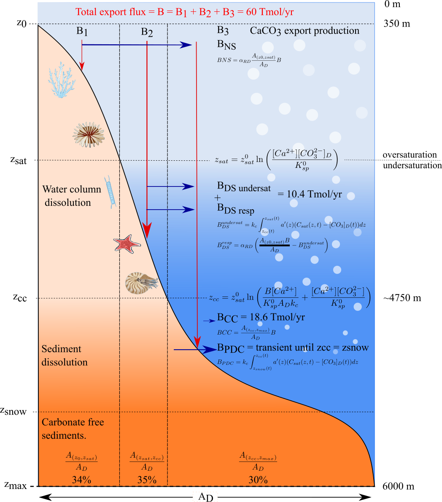

Seawater and Carbon Chemistry
-----------------------------

ESBMTK provides several classes that abstract the handling of basin geometry, seawater chemistry and air-sea gas exchange.  See ``Boudreau2010.py`` `https://github.com/uliw/ESBMTK-Examples <https://github.com/uliw/ESBMTK-Examples>`_ for an actual example how these classes are used to define a model.

Hypsography
~~~~~~~~~~~

For many modeling tasks, it is important to know a globally averaged hypsometric curve. ESBMTK will automatically create a suitable hypsography instance if a :py:class:`esbmtk.esbmtk.Species()` or :py:class:`esbmtk.extended_classes.Reservoir()` instance is specified with the geometry keyword as in the following example where the first list item denotes the upper depth datum, the second list item, the lower depth datum, and the last list item denotes the fraction of the total ocean area if the upper boundary would be at sea level.

.. code:: ipython

    Reservoir(
        name="S_b",  # Name of reservoir group
        geometry=[-200, -800, 1],  # upper, lower, fraction
        concentration="0 mmol/kg",
        species=M.DIC,
        register=M,
    )
    print(f"M.S_b.area = {M.S_b.area:.2e}") # surface area at upper depth datum
    print(f"M.S_b.sed_area = {M.S_b.sed_area:.2e}") # surface between upper and lower datum
    print(f"M.S_b.volume = {M.S_b.volume:.2e}") # total volume

This will register 3 new instance variables, and also create a hypsometry instance at the model level that provides access to the following methods:

.. code:: ipython

    #return the ocean area at a given depth in m**2
    print(f"M.hyp.area(0) = {M.hyp.area(0):.2e}")

    # return the area between 2 depth datums in m**2
    print(f"M.hyp.area_dz(0, -200) = {M.hyp.area_dz(0, -200):.2e}")

    # return the volume between 2 depth datums in m**3
    print(f"M.hyp.volume(0,-200) = {M.hyp.volume(0,-200):.2e}")

    # return the total surface area of earth in m**2
    print(f"M.hyp.sa = {M.hyp.sa:.2e}")

The hypsometric data is based on the Scripps’ SRTM15+V2.5.5 grid (Tozer et al., 2019, `https://doi.org/10.1029/2019EA000658 <https://doi.org/10.1029/2019EA000658>`_), which was down-sampled to a 5-minute grid before processing the hypsometry. 

Seawater
~~~~~~~~

ESBMTK provides a :py:class:`esbmtk.seawater.SeawaterConstants()` class that will be automatically instantiated when a :py:class:`esbmtk.extended_classes.Reservoir()` instance 
definition includes the ``seawater_parameters`` keyword. This keyword expects a dictionary that specifies temperature, salinity, and pressure for a given ``Reservoirgroup``. The class methods and instance variables are accessible via the ``swc`` instance.

.. code:: ipython

    Reservoir(
        name="S_b",  # box name
        geometry=[-200, -800, 1],  # upper, lower, fraction
        concentration={M.DIC: "2220 umol/kg", M.TA: "2300 umol/kg"},
        seawater_parameters={
            "T": 25,  # Deg celsius
            "P": 0,  # Bar
            "S": 35,  # PSU
        },
        register=M,
    )
    # Acess the sewater_parameters with the swc instance
    print(f"M.S_b.density = {M.S_b.swc.density:.2e}")

Apart from density, this class will provide access to a host of instance parameters, e.g., equilibrium constants - see :py:meth:`esbmtk.seawater.SeawaterConstants.update_parameters()` for the currently defined names. Most of these values are computed by ``pyCO2SYS`` (`https://doi.org/10.5194/gmd-15-15-2022 <https://doi.org/10.5194/gmd-15-15-2022>`_). Using  ``pyCO2SYS`` provides access to a variety of parametrizations for the respective equilibrium constants, various pH scales, as well as different methods to calculate buffer factors. Unless explicitly specified in the model definition, ESBMTK uses the defaults set by pyCO2SYS. Note that when using the seawater class, the model concentration unit must be set to ``mol/kg`` as in the following example:

.. code:: ipython

    M = Model(
        stop="6 Myr",  # end time of model
        max_timestep="1 kyr",  # upper limit of time step
        element=["Carbon"],  # list of element definitions
        concentration_unit="mol/kg",
        opt_k_carbonic=13,  # Use Millero 2006
        opt_pH_scale=1,  # 1:total, 3:free scale
    )

Caveats
^^^^^^^

- Seawater Parameters are only computed once when the ``Reservoir`` is instantiated, to provide an initial steady state. Subsequent changes to seawater chemistry or physical parameters do not affect the initial state.

- The ``swc`` instance provides a ``show()`` method listing most values. However, that list may not be comprehensive.

- See the pyCO2SYS documentation for a list of parameters and options `https://pyco2sys.readthedocs.io/en/latest/ <https://pyco2sys.readthedocs.io/en/latest/>`_

- The code example ``seawater_example.py`` in the examples directory

Carbon Chemistry
~~~~~~~~~~~~~~~~

pH
^^

Unless explicitly requested (see above), pH will be reported on the total scale. The hydrogen ion concentration ([H\ :sup:`+`\]) is computed by pyCO2SYS based on the initial DIC and total alkalinity (TA) concentrations. Subsequent hydrogen concentration calculations use the iterative approach of Follows et al. 2005 (`https://doi.org/10.1016/j.ocemod.2005.05.004 <https://doi.org/10.1016/j.ocemod.2005.05.004>`_). 

Provided that the model has terms for DIC and TA, pH calculations for a given :py:class:`esbmtk.extended_classes.Reservoir()` instance are added using the :py:func:`esbmtk.bio_pump_functions0.carbonate_chemistry.add_carbonate_system_1()` function:

.. code:: ipython

    box_names = [A_sb, I_sb, P_sb, H_sb]  # list of Reservoir handles
    add_carbonate_system_1(box_names)

This will create Species :py:class:`esbmtk.esbmtk.Species()` instances for ``Hplus`` and ``CO2aq``. After running the model, the resulting concentration data is available in the usual manner:

.. code:: ipython

    A_sb.Hplus.c
    A_sb.CO2aq.c

The remaining carbonate species are calculated during post-processing (see the :py:func:`esbmtk.post_processing.carbonate_system_1_pp()` function) and are available as

.. code:: ipython

    A_sb.pH
    A_sb.HCO3
    A_sb.CO3
    A_sb.Omega

Notes:
::::::

- The resulting concentration data depends on the choice of equilibrium constants and how they are calculated (see the ``opt_k_carbonic``, ``opt_buffers_mode`` keywords above).

- The data from post-processing is currently available as :py:class:`esbmtk.extended_classes.VectorData()` instance, rather than as :py:class:`esbmtk.esbmtk.Species()` instance.

- Species that use carbonate system 2 (see below), do not need to use carbonate system 1

- ESBMTK will print a warning message of the pH changes by more than 0.01 units per time step. However, this is only a crude measure, since the solver also uses interpolation between integration steps. So this may not catch all possible scenarios.

Carbonate burial and dissolution
^^^^^^^^^^^^^^^^^^^^^^^^^^^^^^^^

Carbonate burial and dissolution use the parametrization proposed by Boudreau et al. 2010 (`https://doi.org/10.1029/2009gb003654 <https://doi.org/10.1029/2009gb003654>`_). The current ESBMTK implementation  has the following shortcomings:

- It only considers Calcium dissolution/burial (although it would be easy to add Aragonite)

- Results will only be correct as long as the depth of the saturation horizon remains below the upper depth datum of the deep-water box. Future versions will address this limitation.

The following figure provides an overview of the parametrizations and variables used by the  :py:func:`esbmtk.bio_pump_functions0.carbonate_chemistry.carbonate_system_2()` and :py:func:`esbmtk.bio_pump_functions0.carbonate_chemistry.add_carbonate_system_2()` functions.

.. _boudreau:

    Overview of the parametrizations and variables used by the :py:func:`esbmtk.bio_pump_functions0.carbonate_chemistry.carbonate_system_2()` and :py:func:`esbmtk.bio_pump_functions0.carbonate_chemistry.add_carbonate_system_2()` functions. Image Credit: Tina Tsan & Mahruk Niazi

Provided a given model has data for DIC & TA, and that the carbonate export flux is known, ``carbonate_system_2`` can be added to a Reservoir instance in the following way:

.. code:: ipython

    surface_boxes: tp.List = [M.L_b]
    deep_boxes: tp.List = [M.D_b]
    export_fluxes: tp.List = M.flux_summary(filter_by="PIC_DIC L_b", return_list=True)

    add_carbonate_system_2(
            r_db=deep_boxes,  # list of reservoir groups
            r_sb=surface_boxes,  # list of reservoir groups
            carbonate_export_fluxes=export_fluxes,  # list of export fluxes
            z0=-200,  # depth of shelf
            alpha=alpha,  # dissolution coefficient, typically around 0.6
        )

Notes:

- boxes and fluxes are lists, since in some models there is more than one surface box (e.g., models that resolve individual ocean basins)

- ESBMTK only considers the sediment area to 6000 mbsl. The area contributed by the elevations below 6000 mbsl is negligible, and this constrain simplifies the hypsographic fit.

- The total sediment area of a given ``Reservoir`` is known provided the box-geometry was specified correctly.

- The :py:func:`esbmtk.bio_pump_functions0.carbonate_chemistry.carbonate_system_2()` function only returns [H\ :sup:`+`\] and the dissolution flux for  given box. It does not return the burial flux.

- Please study the actual model implementations provided in the examples folder.

Post-Processing
^^^^^^^^^^^^^^^

As with ``carbonate_system_1`` the remaining carbonate species are not part of the equation system, rather they are calculated once a solution has been found. Since the solver does not store the carbonate export fluxes, one first has to calculate the relevant fluxes from the concentration data in the model solution. This is however model dependent (i.e., export productivity as a function of residence time, or as a function of upwelling flux), and as such post-processing of ``carbonate_system_2``  is not done automatically, but has to be initiated manually, e.g., like this:

.. code:: ipython

    # get CaCO3_export in mol/year
    CaCO3_export = M.CaCO3_export.to(f"{M.f_unit}").magnitude
    carbonate_system_2_pp(
        M.D_b,  # Reservoir
        CaCO3_export,  # CaCO3 export flux
        200,  # z0
        6000,  # zmax
    )

This will compute all carbonate species similar to ``carbonate_system_1_pp``, and in addition calculate:

.. code:: ipython

    M.D_b.Fburial  # CaCO3 burial flux mol/year
    M.D_b.Fdiss  # CaCO3 dissolution flux mol/year
    M.D_b.zsat  # Saturation depth in mbsl
    M.D_b.zcc  # CCD depth in mbsl
    M.D_b.zsnow  # Snowline depth in mbsl

see  the :py:func:`esbmtk.post_processing.carbonate_system_2_pp()` function for details.

Gas Exchange
~~~~~~~~~~~~

ESBMTK implements gas exchange across the Air-Sea interface as a :py:class:`esbmtk.connections.Species2Species()` instance, between a :py:class:`esbmtk.extended_classes.GasReservoir()` and a :py:class:`esbmtk.esbmtk.Species()` instance. In the following example, we first declare a ``Gasreservoir`` and then connect it with a regular surface box. Note that the CO\ :sub:`2`\ gas transfer calculation requires that the respective surface reservoir carries the ``CO2aq`` tracer as calculated by the :py:func:`esbmtk.bio_pump_functions0.carbonate_chemistry_carbonate_system_1.()` function since the gas-transfer depends on the dissolved CO\ :sub:`2`\ rather than on the DIC concentration.

.. code:: ipython

    GasReservoir(
        name="CO2_At",
        species=M.CO2,
        species_ppm="280 ppm",
    )
    Species2Species(  # Example for CO2
        source=M.CO2_At,  # GasReservoir
        sink=M.L_b.DIC,  # Reservoir
        species=M.CO2,
        piston_velocity="4.8 m/d",
        ctype="gasexchange",
        id="L_b_GEX",  # connection id
    )

Defining gas transfer for O2  uses the same approach. 

pCO\ :sub:`2`\ Dependent Weathering
~~~~~~~~~~~~~~~~~~~~~~~~~~~~~~~~~~~

ESBMTK defines a simple power law function to calculate pCO\ :sub:`2`\ dependent weathering fluxes (see e.g., Walker and Hays, 1981, `https://doi.org/10.1029/jc086ic10p09776 <https://doi.org/10.1029/jc086ic10p09776>`_):

.. math::

    f =  A \times  f_{0} \times  \left(\frac{pCO_{2}}{p_{0}CO_{2}}\right)^{c}

where :math:`A` denotes the area, :math:`f_0` the weathering flux at :math:`p_{0}CO_2`, pCO\ :sub:`2`\ the CO\ :sub:`2`\ partial pressure at a given time :math:`t`, :math:`p_{0}CO_2` the reference partial pressure of CO\ :sub:`2`\ and :math:`c` a constant.  See the :py:func:`esbmtk.processes.weathering()` function for details. Within the context of ESBMTK, weathering fluxes are just another connection type:

.. code:: ipython

    Species2Species(  # CaCO3 weathering
        source=M.Fw.DIC,  # source of flux
        sink=M.L_b.DIC,
        reservoir_ref=M.CO2_At,  # pCO2
        scale=1,  # optional, defaults to 1
        ex=0.2,  # exponent c
        pco2_0="280 ppm",  # reference pCO2
        rate="12 Tmol/a",  # rate at pco2_0
        ctype="weathering",
        id="wca",
    )
