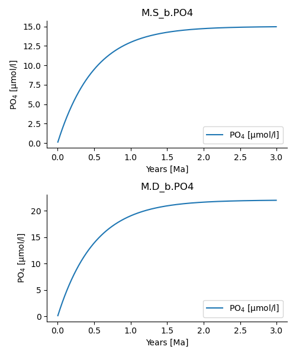

=============
ESBMTK Manual
=============

1 Installation
--------------

1.1 Conda
~~~~~~~~~

Currently, ESBMTK is only available via `https://pypi.org/project/esbmtk/ <https://pypi.org/project/esbmtk/>`_, and there is no recipe to install with conda. ESBMTK relies on the following libraries that need to be installed with conda before you can install ESBMTk with ``pip``: As usual, it is recommended to first create a new virtual environment, and then install the following:

- python >= 3.9

- matplotlib

- numpy

- pandas

- typing

- pint

- scipy

- pyCO2sys

afterwards you can install esbmtk with ``python -m pip install esbmtk``

1.2 pip & github
~~~~~~~~~~~~~~~~

If you work with pip, simply install  with ``python -m pip install esbmtk``, or download the code from `https://github.com/uliw/esbmtk <https://github.com/uliw/esbmtk>`_

2 A simple example
------------------

A simple model of the marine P-cycle would consider the delivery of P from weathering, the burial of P in the sediments, the thermohaline transport of dissolved PO\ :sub:`4`\ as well as the export of P in the form of sinking organic matter (POP). The concentration in the respective surface and deep water boxes is then the sum of the respective fluxes (see Fig. 1). The model parameters are taken from Glover 2011, Modeling Methods in the Marine Sciences.

.. _pcycle:

.. figure:: ./mpc.png
    :width: 300

    A two-box model of the marine P-cycle. F\ :sub:`w`\ = weathering F\ :sub:`u`\ = upwelling, F\ :sub:`d`\ = downwelling, F\ :sub:`POP`\ = particulate organic phosphor, F\ :sub:`b`\ = burial.

If we define equations that control the export of particulate P (F\ :sub:`POP`\) as a fraction of the upwelling P (F\ :sub:`u`\), and the burial of P (F\ :sub:`b`\) as a fraction of (F\ :sub:`POP`\), we express this model as coupled ordinary differential equations (ODE, or initial value problem):

.. math::

    \frac{d[PO_{4}]_{S}}{dt} = \frac{F_w + F_u - F_d - F_{POP}}{V_S}

and for the deep ocean, 

.. math::

    \frac{d[PO_{4}]_{D}}{dt}= \frac{F_{POP} + F_d - F_u - F_b}{V_D}

which is easily encoded as a Python function

.. code:: ipython

    def dCdt(t, C_0, V, F_w, thx):
        """Calculate the change in concentration as
        a function of time. After Glover 2011, Modeling
        Methods for Marine Science.

        :param C: list of initial concentrations mol/m*3
        :param time: array of time points
        :params V: lits of surface and deep ocean volume [m^3]
        :param F_w: River (weathering) flux of PO4 mol/s
        :param thx: thermohaline circulation in m*3/s
        :returns dCdt: list of concentration changes mol/s
        """

        C_S = C_0[0]  # surface
        C_D = C_0[1]  # deep
        F_d = C_S * thx  # downwelling
        F_u = C_D * thx  # upwelling
        tau = 100 # residence time of P in surface waters [yrs]
        F_POP = C_S * V[0] / tau  # export production
        F_b = F_POP / 100  # burial

        dCdt[0] = (F_w + F_u - F_d - F_POP) / V[0]
        dCdt[1] = (F_d + F_POP - F_u - F_b) / V[1]

        return dCdt

2.1 Implementing the P-cycle with ESBMTK
~~~~~~~~~~~~~~~~~~~~~~~~~~~~~~~~~~~~~~~~

While ESBMTK provides abstractions to efficiently define complex models, the following section will use the basic ESBMTK classes to define the above model. While quite verbose, it demonstrates the design philosophy behind ESBMTK. More complex approaches are described further down. 

2.1.1 Foundational Concepts
^^^^^^^^^^^^^^^^^^^^^^^^^^^

ESBMTK uses a hierarchically structured object-oriented approach to describe a model. The topmost object is the model object that describes fundamental properties like run time, time step, elements and species information. All other objects derive from the model object. 

.. _m1:

.. figure:: ./model2.png
    :width: 600

    Schematic outlining the object hierarchy in ESBMTK Reservoirs contain the data for a given species. Multiple reservoirs form a group that share common characteristics, e.g., volume, area, pressure, temperature etc. The relationship between reservoir groups (and/or Reservoirs) are defined by a connection object that defines e.g., a rate function etc. Connection objects can be dynamically modified by a Signal. ReservoirGroups have various sub-classes that provide access to e.g., hypsographic data, or perform carbonate chemistry calculations.

The model geometry is then parsed to build a suitable equation system.

2.1.2 Defining the model geometry and initial conditions
^^^^^^^^^^^^^^^^^^^^^^^^^^^^^^^^^^^^^^^^^^^^^^^^^^^^^^^^

In the first step, one needs to define a model object that describes fundamental model parameters. The following code first loads the following esbmtk classes that will help with model construction:

- :py:class:`esbmtk.esbmtk.Model()`

- :py:class:`esbmtk.esbmtk.Reservoir()`

- :py:class:`esbmtk.connections.Connection()` class

- :py:class:`esbmtk.esbmtk.Source()` class

- :py:class:`esbmtk.esbmtk.Sink()` class

- and ``Q_`` which belongs to the pint library.

.. code:: ipython

    # import classes from the esbmtk library
    from esbmtk import (
        Model,  # the model class
        Reservoir,  # the reservoir class
        Connection,  # the connection class
        Source,  # the source class
        Sink,  # sink class
        Q_,  # Quantity operator
    )

Next we use the ``Model`` class to create a model instance that defines basic model properties. Note that units are automatically translated into model units. While convenient, there are some important caveats: 
Internally, the model uses 'year' as the time unit, mol as the mass unit, and liter as the volume unit. You can change this by setting these values to e.g., 'mol' and 'kg', however, some functions assume that their input values are in 'mol/l' rather than mol/m\*\*3 or 'kg/s'. Ideally, this would be caught by ESBMTK, but at present, this is not guaranteed. So your mileage may vary if you fiddle with these settings.  Note: Using mol/kg e.g., for seawater, will be discussed below.

.. code:: ipython

    # define the basic model parameters
    M = Model(
        name="M",  # model name
        stop="3 Myr",  # end time of model
        timestep="1 kyr",  # upper limit of time step
        element=["Phosphor"],  # list of element definitions
    )

Next, we need to declare some boundary conditions. Most ESBMTK classes will be able to accept input in the form of strings that also contain units (e.g., ``"30 Gmol/a"`` ). Internally these strings are parsed and converted into the model base units. This works most of the time, but not always. In the below example, we define the residence time :math:`\tau`.  This variable is then used as input to calculate the scale for the primary production as ``M.S_b.volume / tau`` which must fail since ``M.S_b.volume`` is a numeric value and ``tau`` is a string. 

.. code:: ipython

    # try the following
    tau = "100 years"
    tau * 12

To avoid this we have to manually parse the string into a quantity. This is done with the quantity operator ``Q_`` Note that ``Q_`` is not part of ESBMTk but imported from the ``pint`` library. 

.. code:: ipython

    # now try this
    from esbmtk import Q_
    tau = Q_("100 years")
    tau * 12

Most ESBMTK classes accept quantities, strings that represent quantities as well as numerical values. Weathering and burial fluxes are often defined in ``mol/year``, whereas ocean models use ``kg/year``. ESBMTK provides a method (``set_flux()`` )  that will automatically convert the input into the correct units. In this example, it is not necessary since the flux and the model both use ``mol`` . It is however good practice to rely on the automatic conversion. Note that it makes a difference for the mol to kilogram conversion whether ones uses ``M.P`` or ``M.PO4`` as the reference species!

.. code:: ipython

    # boundary conditions
    F_w =  M.set_flux("45 Gmol", "year", M.P) # P @280 ppm (Filipelli 2002)
    tau = Q_("100 year")  # PO4 residence time in surface box
    F_b = 0.01  # About 1% of the exported P is buried in the deep ocean
    thc = "20*Sv"  # Thermohaline circulation in Sverdrup

To set up the model geometry, we first use the :py:class:`esbmtk.esbmtk.Source()` and :py:class:`esbmtk.esbmtk.Reservoir()` classes to create a source for the weathering flux, a sink for the burial flux, and instances of the surface and deep ocean boxes. Since we loaded the element definitions for phosphor in the model definition above, we can directly refer to the "PO4" species in the reservoir definition. 

.. code:: ipython

    # Source definitions
    Source(
        name="weathering",
        species=M.PO4,
        register=M,  # i.e., the instance will be available as M.weathering
    )
    Sink(
        name="burial",
        species=M.PO4,
        register=M,  #
    )

    # reservoir definitions
    Reservoir(
        name="sb",  # box name
        species=M.PO4,  # species in box
        register=M,  # this box will be available as M.S_b
        volume="3E16 m**3",  # surface box volume
        concentration="0 umol/l",  # initial concentration
    )
    Reservoir(
        name="db",  # box name
        species=M.PO4,  # species in box
        register=M,  # this box will be available M.D_b
        volume="100E16 m**3",  # deeb box volume
        concentration="0 umol/l",  # initial concentration
    )

2.1.3 Model processes
^^^^^^^^^^^^^^^^^^^^^

For many models, processes can mapped as the transfer of mass from one box to the next. Within the ESBMTK framework, this is accomplished through the :py:class:`esbmtk.connections.Connection()` class. To connect the weathering flux from the source object (M.w) to the surface ocean (M.S\ :sub:`b`\) we declare a connection instance describing this relationship as follows:

.. code:: ipython

    Connection(
        source=M.weathering,  # source of flux
        sink=M.S_b,  # target of flux
        rate=F_w,  # rate of flux
        id="river",  # connection id
        ctype="regular",
    )

Unless the ``register`` keyword is given, connections will be automatically registered with the parent of the source, i.e., the model ``M``. Unless explicitly given through the ``name`` keyword, connection names will be automatically constructed from the names of the source and sink instances. However, it is a good habit to provide the ``id`` keyword to keep connections separate in cases where two reservoir instances share more than one connection. The list of all connection instances can be obtained from the model object (see below).

To map the process of thermohaline circulation, we connect the surface and deep ocean boxes using a connection type that scales the mass transfer as a function of the concentration in a given reservoir (``ctype ="scale_with_concentration"`` ). The concentration data is taken from the reference reservoir which defaults to the source reservoir. As such, in most cases, the ``ref_reservoirs`` keyword can be omitted. The ``scale`` keyword can be a string or a numerical value. If it is provided as a string ESBMTK will map the value into model units. Note that the connection class does not require the ``name`` keyword. Rather the name is derived from the source and sink reservoir instances. Since reservoir instances can have more than one connection (i.e., surface to deep via downwelling, and surface to deep via primary production), it is required to set the ``id`` keyword.

.. code:: ipython

    Connection(  # thermohaline downwelling
        source=M.S_b,  # source of flux
        sink=M.D_b,  # target of flux
        ctype="scale_with_concentration",
        scale=thc,
        id="downwelling_PO4",
        # ref_reservoirs=M.S_b, defaults to the source instance
    )
    Connection(  # thermohaline upwelling
        source=M.D_b,  # source of flux
        sink=M.S_b,  # target of flux
        ctype="scale_with_concentration",
        scale=thc,
        id="upwelling_PO4",
    )

There are several ways to define biological export production, e.g., as a function of the upwelling PO\ :sub:`4`\, or as a function of the residence time of PO\ :sub:`4`\ in the surface ocean. Here we follow Glover (2011) and use the residence time :math:`\tau` = 100 years.

.. code:: ipython

    Connection(  #
        source=M.S_b,  # source of flux
        sink=M.D_b,  # target of flux
        ctype="scale_with_concentration",
        scale=M.S_b.volume / tau,
        id="primary_production",
    )

We require one more connection to describe the burial of P in the sediment. We describe this flux as a fraction of the primary export productivity. To create the connection we can either recalculate the export productivity or use the previously calculated flux. We can query the export productivity using the ``id_string`` of the above connection with the
:py:meth:`esbmtk.esbmtk.Model.flux_summary()` method of the model instance:

.. code:: ipython

    M.flux_summary(filter_by="primary_production", return_list=True)[0]

The ``flux_summary()`` method will return a list of matching fluxes but since there is only one match, we can simply use  the first result, and use it to define the phosphor burial as a consequence of export production in the following way:

.. code:: ipython

    Connection(  #
        source=M.D_b,  # source of flux
        sink=M.burial,  # target of flux
        ctype="scale_with_flux",
        ref_flux=M.flux_summary(filter_by="primary_production", return_list=True)[0],
        scale=F_b,
        id="burial",
    )

Running the above code (see the file ``po4_1.py`` in the examples directory), results in the following graph:

.. _po41:

    Example output from ``po4_1.png``

2.2 Working with the model instance
~~~~~~~~~~~~~~~~~~~~~~~~~~~~~~~~~~~

2.2.1 Running the model, visualizing and saving the results
^^^^^^^^^^^^^^^^^^^^^^^^^^^^^^^^^^^^^^^^^^^^^^^^^^^^^^^^^^^

To run the model, use the ``run()`` method of the model instance, and plot the results with the ``plot()`` method. This method accepts a list of esbmtk instances, that will be plotted in a common window. Without further arguments, the plot will also be saved as a pdf file where ``filename`` defaults to the name of the model instance. The ``save_data()`` method will create (or recreate) the ``data`` directory which will then be populated by csv-files. 

.. code:: ipython

    M.run()
    M.plot([M.S_b, M.D_b])
    M.save_data()

2.2.2 Saving/restoring the model state
^^^^^^^^^^^^^^^^^^^^^^^^^^^^^^^^^^^^^^

Many models require a spin-up phase. Once the model is in equilibrium, you can save the save the state with the ``save_state()`` method. 

.. code:: ipython

    M.run()
    M.save_state()

Restarting the model from a saved state requires that you first initialize the model geometry (i.e., declare all the connections etc), and then read the previously saved model state.

.. code:: ipython

    ....
    ....
    M.read_state()
    M.run()

Towards this end, note that a repeated model run will not be initialized from the last known state, but rather starts from a blank state.

.. code:: ipython

    .....
    .....
    M.run()

To restart a model from the last known state, the above would need to be written as

.. code:: ipython

    .....
    .....
    M.run()
    M.save_state()
    M.read_state()
    M.run()

2.2.3 Introspection and data access
^^^^^^^^^^^^^^^^^^^^^^^^^^^^^^^^^^^

All esbmtk instances and instance methods support the usual python methods to show the documentation, and inspect object properties.

.. code:: ipython

    help(M.S_b)  # will print the documentation for sb
    dir(M.S_b)  # will print all methods for sb
    M.S_b #  when issued in an interactive session, this will echo
    # the arguments used to create the instance

The concentration data for a given reservoir is stored in the following instance variables:

.. code:: ipython

    M.S_b.c  # concentration
    M.S_b.m  # mass
    M.S_b.v  # volume
    M.S_b.d  # delta value (if used by model)
    M.S_b.l  # the concentration of the light isotope (if used)

The model time axis is available as ``M.time`` and the model supports the ``connection_summary()`` and ``flux_summary`` methods to query the respective ``connection`` and ``flux`` objects. 
