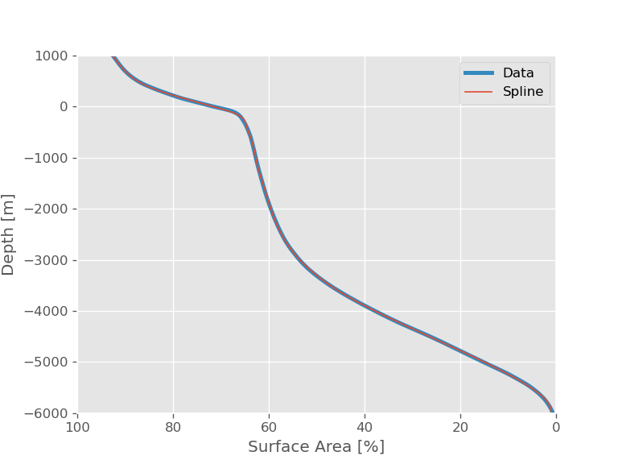

=============
ESBMTK Manual
=============

1 Seawater & Carbon Chemistry
-----------------------------

ESBMTK provides several classes that abstract the handling of basin geometry, seawater chemistry and air-sea gas exchange.

1.1 Hypsography
~~~~~~~~~~~~~~~

For many modeling tasks, it is important to have knowledge of a globally averaged hypsometric curve. ESBMTK will automatically create a suitable hypsography instance if a :py:class:`esbmtk.esbmtk.Reservoir()` or :py:class:`esbmtk.extended_classes.ReservoirGroup()` instance is specified with the geometry keyword as in the following example where the first list item denotes the upper depth datum, the second list item, the lower depth datum, and the last list item denotes the fraction of the total ocean area if the upper boundary would be at sealevel.

.. code:: ipython

    Reservoir(
        name="S_b",  # Name of reservoir group
        geometry=[-200, -800, 1],  # upper, lower, fraction
        concentration="1 mmol/kg",
        species=M.DIC,
        register=M,
    )
    print(f"M.S_b.area = {M.S_b.area:.2e}") # surface area at upper depth datum
    print(f"M.S_b.sed_area = {M.S_b.sed_area:.2e}") # surface between upper and lower datum
    print(f"M.S_b.volume = {M.S_b.volume:.2e}") # total volume

This will register 3 new instance variables, and also create a hypsometry instance at the model level that provides access to the following methods:

.. code:: ipython

    #return the ocean area at a given depth in m**2
    print(f"M.hyp.area(0) = {M.hyp.area(0):.2e}")

    # return the area between 2 depth datums in m**2
    print(f"M.hyp.area_dz(0, -200) = {M.hyp.area_dz(0, -200):.2e}")

    # return the volume between 2 depth datums in m**3
    print(f"M.hyp.volume(0,-200) = {M.hyp.volume(0,-200):.2e}")

    # return the total surface area of earth in m**2
    print(f"M.hyp.sa = {M.hyp.sa:.2e}")

Internally, the hypsometric data is parameterized as a spline function that provides a reasonable fit between -6000 mbsl to 1000 above sealevel. The data was fitted against hypsometric data derived from 
Scripps’ SRTM15+V2.5.5 grid (Tozer et al., 2019, `https://doi.org/10.1029/2019EA000658 <https://doi.org/10.1029/2019EA000658>`_), which was down-sampled to a 5 minute grid before processing the hypsometry. The following figure shows a comparison between the spline fit, and the actual data. The file ``hypsometry.py`` provides further examples.

.. _hyp:

    Comparison between spline fit, and the actual data.

1.2 Seawater
~~~~~~~~~~~~

1.3 Carbon Chemistry
~~~~~~~~~~~~~~~~~~~~
